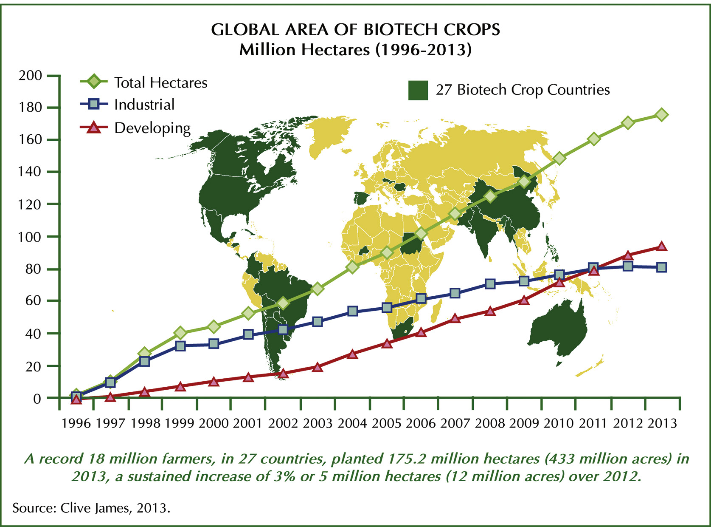
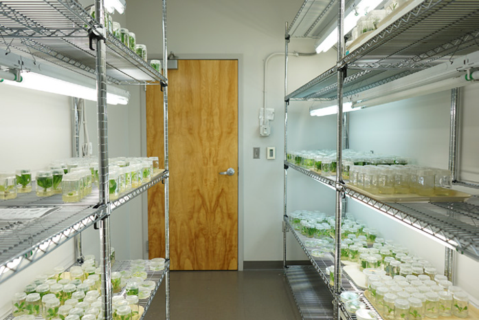
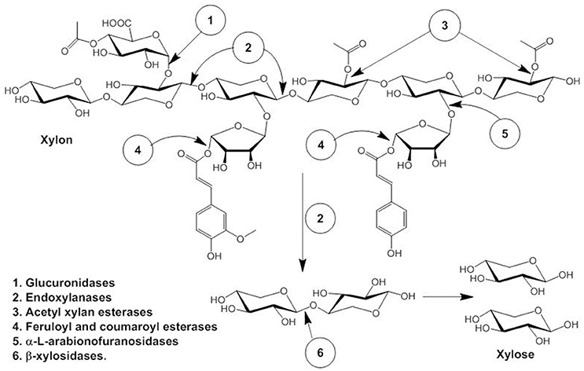
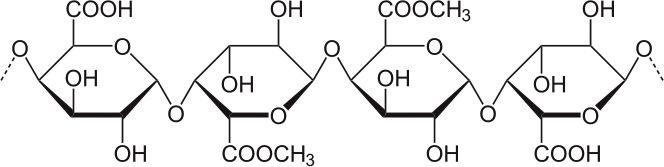

```{r setup, include=FALSE}
library(knitr)
require(tidyverse)
set.seed(453)
# invalidate cache when the package version changes
knitr::opts_chunk$set(tidy = FALSE, echo = FALSE, 
                  message = FALSE, warning = FALSE,
                  out.width = "50%")
options(knitr.table.format = "latex")
options(knitr.kable.NA = "", digits = 2)
options(kableExtra.latex.load_packages = FALSE)
```

# Background

### Overview

- Biotechnology has been around ever since humans began manipulating the natural environment to improve their food supply, housing and health.

\begin{columns}[T,onlytextwidth]
  \scriptsize
  \column{0.4\textwidth}
  \begin{alertblock}{Alert}
  In 1974, a herd of 150 elephants in West Bengal, India, became intoxicated after breaking into a brewery, then went on a rampage that destroyed buildings and killed five people.
  \end{alertblock}

  \column{0.6\textwidth}
  
```{r elephant-intoxication, fig.cap="An intoxicated monkey", out.width="35%"}

```

\end{columns}

- \alert{Plant Biotechnology} encompasses a multitude of scientific tools and techniques for screening and genetic manipulation of plants to develop beneficial or useful plant/plant products^[Plants produced by the insertion of specific segments of foreign nucleic acid/gene sequence into its genome using transformation method (such as *Agrobacterium* -mediated) are known as transgenic plants.]. 

### Use of Biotechnologically derived crops worldwide

\footnotesize

- As of 2019, 525 transgenic events in 32 crops have been commercialized^[\url{https://www.isaaa.org/gmapprovaldatabase/default.asp}].
  - Maize accounts for 238 events, followed by cotton (61), potato (49), Argentine canola (42), soybean (41), carnation (19) and others.
- On average transgenic technology has increased crop yields by 22% which has led to an estimated 68% increase in farmer profits. [@klumper2014meta]
- Global area of transgenic crops has increased from 1.7 million hectare in 1996 to 191.7 million hectares in 2018, i.e. around 113-fold increase.

```{r biotech-crops, fig.cap = "Area of transgenic crops planted worldwide from 1996–2013. From James C (2013). Global Status of Commercialized Biotech/GM Crops for 2013: ISAAA Brief 43. ISAAA, Ithaca, NY.", out.width="40%"}

```

###

- Worldwide, soybean, maize, canola and cotton have experienced a substantial addition of production volume and value with GM crop technology.
- Major traits of targets have been herbicide resistance, stacked traits, and insect resistance (ISAAA, 2018).
  - GM IR crops (*Bt* potato, *Bt* maize, *Bt* cotton) account for 12% of global plantings
  - GM with stacked traits account for 41% of global plantings
  - GM HT (Bromoxynil herbicide-resistant cotton, glyphosate-resistant soybean) crops account for 47% of global plantings

```{r biotech-crops-cropwise-2018, fig.cap = "Percentage coverage of transgenic crops planted worldwide during 2018", out.width="25%"}
require(tidyverse)
require(viridisLite)
theme_set(theme_light())

tribble(
  ~"crop", ~"coverage",
  "Canola", 5.3,
  "Cotton", 13,
  "Corn", 31,
  "Soybean", 50,
  "Other", 0.7
) %>% 
  ggplot(aes(x = "", y = coverage, fill = crop)) +
  geom_col(position = 'stack',
           color = 'black',
           width = 2, show.legend = FALSE) +
  geom_text(aes(label = paste0(crop, "\n", scales::percent(coverage, scale = 1))),
            position = position_stack(vjust = 0.6),
            size = 3, show.legend = FALSE) +
  coord_polar(theta = "y") +
  scale_fill_viridis_d(alpha = 0.6) +
  theme_classic() +
  theme(axis.line = element_blank(),
        axis.text = element_blank(),
        # axis.text = element_blank(),
        axis.ticks = element_blank(),
        axis.title.y = element_blank(),
        axis.title.x = element_blank(),
        plot.title = element_text(hjust = 0.5, color = "#666666"))
```

# Good versus Evil

### Pros

- GM crops have contributed to a significant reduction in the global environmental impact
of production agriculture. Since 1996, the use of pesticides was reduced by 503 million kg of AI, constituting an 8.8% reduction, and the overall environmental impact associated with pesticide use on these crops was reduced by 18.7%

- GM IR cotton has contributed a 25.6% reduction in the volume of AI used and a 28.2% reduction in the EIQ^[An assessment of both pesticide active‐ingredient use and the specific pesticides used, developed by Kovach et al. (1992). EIQ value is multiplied by the amount of pesticide active ingredient (AI) used per ha to produce a field EIQ value. For example, EIQ rating for glyphosate is 15.3 and EIQ field value for atrazine is 22.9 per hectare] indicator (1996–2012)

- GM crops have contributed to reduction in fuel use and cost reduction for farmers in cultivation and pest control.

###

- Abiotic stress tolerance (Maize - 7, sugarcane - 3, soybean - 2). Abiotic stresses cause alterations in expression of an array of genes, hence adaptation to these require interplay of many gene networks (ISAAA, 2019).
  - Bacterial cold shock proteins (*csp*, Csp3, CspB) for heat, cold and water-deficit stress (CspB has been used in Monsanto's drought-tolerant transgenic commercial maize hybrid);
  - Transcription factors (Overexpression of *Hahb*-4, a *Helianthus annus* homeobox-leucine zipper gene, which is induced by water-deficit conditions and binds to cis-elements of genes regulated by dehydration, with a constitutive or its own promoter imparts drought tolerance.) 
- Development of disease resistant crops (Resistance to Cucumber MV, Zucchini YMV, Watermelon mosaic poty virus 2 in \alert{Squash} by expression of viral coat protein (cp) gene as transgene; Resistance to Papaya ringspot virus using viral coat protein in Papaya)
- Improvement of nutritional quality -- Biofortification.
  - Provitamin A biofortified rice (Uses *psy* gene from daffodil and *crtI* gene from bacterium, *Erwinia uredovora*)
  - Modified lipid content in oilseed crops (18 transgenic events as of 2019)

###

- Rapid regeneration of plantlets and propagules using micropropagation.
- Plant and animal disease diagnosis and characterization.
- Rapid gain in crop improvement using molecular marker assisted breeding.
- Characterization, conservation and use of germplasm
  - DNA fingerprinting
  - Cryopreservation techniques
  - In-vitro regeneration, haploidization

### Cons

- Regards for human health, mostly concerning toxicity and allergenicity
- Indiscriminate use of herbicide and pesticides with possibility for resurgence of super-weeds.
  - Out of 24 glyphosate-resistant weed species, so far, 16 have been reported from transgenic cropping systems (Heap 2014). Amongst them *Conyza canadensis* is the most widespread weed plant whilst *Amaranthus palmeriand* and *Amaranthus tuberculatus* are the two most economically damaging
- Possibility for horizontal transfer of antibiotic-resistant marker genes from transgenic food to animal and human gut microbe.
- Plants with improved resistance to drought, disease, or insect pests would have an advantage in the wild, and thus, hybridization of transgenic crops with wild varieties would be expected to occur.
  - Wild maize (corn) in Mexico examined in 2001 contained transgenic DNA, even though planting transgenic corn plants was stopped in 1998!

# Biotechnology: Its roots into Nepal

### Research and policy

- Biotechnology policy, 2063
  - To increase production and productivity by means of research and development of biotechnology as well as transfer of technology, and improve the living standard of Nepali people by achieving a significant progress in the field of public health and environment

#### What is biotechnology ?

Accomplishes such a task that channelizes the characteristics and property of any organism or their living cells/tissues etc. in the work of human welfare.

### Research highlights and project undertakings by NAST

\footnotesize

- Molecular Characterization and DNA Barcoding of Threatened Flora and Fauna of Nepal

- Research on diabetes and obesity emphasizing discovering of a potent protein tyrosine phosphatase 1B (PTP1B) inhibitor from the medicinal plants of Nepal. PTP1B enzyme plays a paramount role as a negative regulator in insulin and leptin signaling pathways that are concerned with type 2 diabetes and obesity.

- Ex situ conservation via seed banking for collection and conservation of wild plant biodiversity of Nepal and its extension research activity. Seeds of wild plant species are collected from different forest types of Nepal like tropical to alpine forests. Collected seeds thus are curated and conserved under -20 degree C in the seed bank of NAST for research, reintroduction and for forest rehabilitation in the future.

- PCR-Based Diagnosis of Citrus Huanglongbing Disease in Nepal

- Set facilities in Biotechnology Division, NAST
  - Automated DNA Sequencer
  - Tissue lyser
  - Gel Document System
  - Biophotometer
  - SDS PAGE

# Use for Crop improvement in Nepal

### Tissue culture/Micropropagation

```{r tissue-culture-illustration, fig.cap = "A walk-in tissue culture growth room with supplementary cooling and shelves with cool white fluorescent lamps", out.width="60%"}

```

### Molecular tools and application for crop improvement

- Molecular evaluation and characterization of indigineous as well as imported germplasm (maize inbred lines and rice genotypes).
- Rice fungal blast resistance gene screening using molecular markers
- Characterization of maize germplasm using molecular markers
- A QTL for high grain yield under lowland drought in the background of popular rice variety Sabitri from Nepal (Study used SSR markers). [@yadaw2013qtl]
- Identification and mapping of leaf, stem and stripe rust resistance trait loci and their interactions in durum wheat (Study used DArT markers). [@singh2013identification]
- Genetic relatedness and population differentiation of Himalayan hullless barley (H vulgare L.) landrace inferred with SSRs. [@pandey2006genetic]
- Deciphering the genetic basis of root morphology, nutrient uptake, yield, and yield-related traits in rice under dry direct-seeded cultivation systems (Study used GWAS). [@sandhu2019deciphering]

# General use in Nepal

###

- DFTQC is providing Pesticide Residue Analysis (using RBPR method) and microbial testing facilities at several food laboratories and quarantine points.
- Prognosis and detection of human/zoonotic pathogens
  - As of 6 December, National Pathogen Genetic Sequencing Consortium, with support from WHO, an extension of National Public Health Laboratory (NPHL) which was set up in March 2021 and grew operational in October 2021 has sequenced around 100 genomes of SARS-CoV-2.
- Clinical analysis of DNA, RNA, chromosomes and proteins for heritable disease diagnosis, prenatal screening and testing of high-risk families.

###

\scriptsize

```{r xylanase-production-purification-nepal, fig.cap="Lignocellulose is mainly obtained from agriculture, horticulture and forest waste, paper-pulp, timber and other agro-forest allied industries. Such lignocelluloses waste can potentially be utilized into various value-added products such as biofuels like bioethanol and biochemical products. Hemicellulose, the second most abundant polysaccharide after cellulose consists of $\\beta$-1, 4 linked D-xylopyranosyl units linked with branches of O-acetyl, $\\alpha$-L-arabinofuranosyl and $\\alpha$-D-glucuronyl residues (La Grange et al., 2001). Synergistic action of several enzymes are required for complete degradation of hemicellulose to pentose sugar, namely endoxylanases (endo-$\\beta$- 1,4-xylanase), $\\beta$-xylosidases (xylan 1,4-$\\beta$-xylosidase), and $\\alpha$- glucuronidases ($\\alpha$-glucosiduronase) and side-chain cleaving enzymes: $\\alpha$-L-arabinofuranosidase, feruloyl esterase, and acetyl xylan esterase that produces xylooligomers which are further degraded to monomeric sugar xylose by $\\beta$-D-xylosidases. \\textbf{Production, Purification, and Characterization of Thermostable Alkaline Xylanase From Anoxybacillus kamchatkensis (Paudwar Hot Springs, Myagdi, Nepal) NASTPD13 (can be cultured at a range of 37-75 degree C temperature, pH 7)}.", out.width="65%"}


```

###

```{r pectinase-isolation-nepal, fig.cap="Pectinase enzymes are classified into polygalcturonase(PG), pectinesterase(PE), and pectin lyase(PL) based on their mode of action on the substrate (Jayani et al. 2005). Pectinase enzymes are extensively used in an industrial sector especially in food industry i.e. fruit juice extraction, coffee and tea fermentation, oil extraction, improvement of chromaticity and stability of red wine (Jayani et al. 2005). Besides food industry; pectinases are widely used in textile, paper and pulp industries, waste-water treatment (Solbak et al. 2005; Ahlawat et al. 2014). More recently, the enzyme has been used with cellulose enzyme for the production bioethanol from lignocellulosic biomass. \\textbf{Alkaline thermostable pectinase enzyme from Aspergillus niger strain MCAS2 isolated from Manaslu Conservation Area, Gorkha, Nepal}", out.width="65%"}


```

# Ethical biotechnology

### Biotechnology whims: A case of mosquito control in Florida, US

\footnotesize

Local officials in Florida have approved the release of 750 million mosquitoes that have been genetically modified to reduce local populations. The aim is to reduce the number of mosquitoes that carry diseases like dengue or the Zika virus.

The green-lighting of a pilot project after years of debate drew a swift outcry from environmental groups, who warned of unintended consequences. Activists warn of possible damage to ecosystems, and the potential creation of hybrid, insecticide-resistant mosquitoes.

But the company involved says there will be no adverse risk to humans or the environment, and points to a slate of government-backed studies. Aedes aegypti mosquitoes are known to spread deadly diseases to humans such as dengue, Zika, chikungunya, and yellow fever.

Only female mosquitoes bite humans because they need blood to produce eggs. So the plan is to release the male, modified mosquitoes who will then hopefully breed with wild female mosquitoes. However, the males carry a protein that will kill off any female offspring before they reach mature biting age. Males, which only feed on nectar, will survive and pass on the genes^[\url{https://www.bbc.com/news/world-us-canada-53856776}].

# Bibliography

### References
