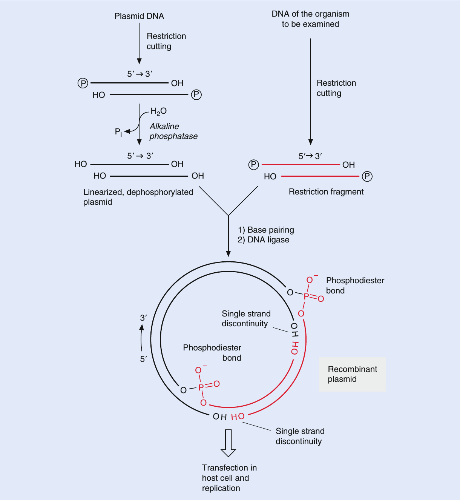
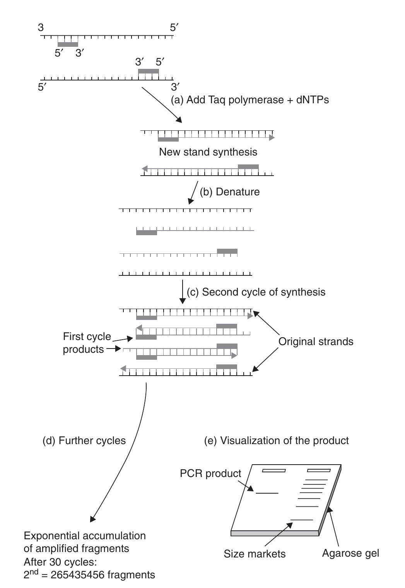

```{r setup, include=FALSE}
library(knitr)
require(tidyverse)
set.seed(453)
# invalidate cache when the package version changes
knitr::opts_chunk$set(tidy = FALSE, echo = FALSE, 
                  message = FALSE, warning = FALSE,
                  out.width = "50%")
options(knitr.table.format = "latex")
options(knitr.kable.NA = "", digits = 2)
options(kableExtra.latex.load_packages = FALSE)
```

# Mechanisms of gene transfer in Bacteria

### Features of prokaryotic and eukaryotic cells

- A eukaryotic cell is subdivided by internal membranes into various membrane-enclosed organelles (Figure \ref{fig:eu-prokaryotic-cell}). 
- In eukaryotic cells, nucleus contains the cell's DNA. 
- The other organelles are located in the cytoplasm, the entire region between the nucleus and outer membrane of the cell.
- The chloroplast is a characterstic organelle found in eukaryotic cells that carry out photosynthesis.
- Prokaryotic cells are much simpler and generally smaller than eukaryotic cells.
- In a prokaryotic cell, the DNA is not separated from the rest of the cell by enclosure in a membrane-bounded nucleus. 
- Prokaryotic cells also lack the other kinds of membrane-enclosed organelles.

### Features of prokaryotic and eukaryotic cells

\begin{columns}[T,onlytextwidth]
  \column{0.55\textwidth}
  
```{r eu-prokaryotic-cell, fig.cap="Contrasting eukaryotic and prokaryotic cells in size and complexity.", out.width="70%"}
# pdftools::pdf_convert("/media/deependra/e4da4ac5-3b38-4b89-9402-397eb940e4d3/Addition/Generalized Study/Reece Campbell Biology 9th txtbk.pdf", pages = 56, dpi = 250, format = "png", filenames = "./../images/eukaryotic_prokaryotic.png")

knitr::include_graphics("./../images/eukaryotic_prokaryotic.png")
```

  \column{0.45\textwidth}

```{r prokaryotic-dna, fig.cap="A prokaryotic chromosome and plasmids. The thin, tangled loops surrounding this ruptured E. coli cell are parts of the cell’s large, circular chromosome (colorized TEM). Three of the cell’s plasmids, the much smaller rings of DNA, are also shown.", out.width="75%"}
# pdftools::pdf_convert("/media/deependra/e4da4ac5-3b38-4b89-9402-397eb940e4d3/Addition/Generalized Study/Reece Campbell Biology 9th txtbk.pdf", pages = 607, dpi = 250, format = "png", filenames = "./../images/prokaryotic_chr_plasmid.png")

knitr::include_graphics("./../images/prokaryotic_chr_plasmid.png")
```

\end{columns}

### Transformation: Introduction

- First observed in bacteria and first bacterial system for genetic transfer to be discovered. 
- Naturally occurs in only certain bacteria, but under laboratory conditions it seems to be possible with any cell type, prokaryotic or eukaryotic.
- When a bacterial cell (living or dead) releases some DNA into the surrounding medium, this DNA is, of course, vulnerable to degradation but may encounter another bacterial cell before any significant change can occur.
- The second cell may take up the DNA, transport it across the cell wall and cell membrane, and allow it to recombine with the homologous portion of the resident bacterial chromosome.
- The resulting recombinant cell is called a \alert{transformant}. 
- The amount of DNA transferred per event is small, on the order of 10 kb in length.

### Transformation

```{r transformation-griffith, fig.cap="Griffith's discovery of transformation in Streptococcus pneumoniae", out.width="28%"}
# pdftools::pdf_convert("../../literatures/textbooks/[D._Peter_Snustad,_Michael_J._Simmons]_Principles of Genetics.pdf", pages = 193, dpi = 250, format = "png", filenames = "./../images/bacterial_transformation.png")


```

### Transduction

\footnotesize

- Bacterial virus (bacteriophage) is intimately involved in the genetic transfer process.
- Phage infections begin with adsorption of virus particles to specific receptor sites on the host cell surface. The nucleic acid contained inside the viral protein coat is then transferred to the cytoplasm of the bacterial cell, where it becomes metabolically active and undergoes replication and transcription.
- Typically there are two possible outcomes of phage infection.
  - **Lytic response**, the virus produces structural components of new phage particles, packages its nucleic acid inside them, and then causes the cell to lyse and release progeny phage. 
  - **Temperate response**, the virus establishes a stable relationship with a host cell (and continues to replicate as a part of host DNA molecule) in which some phage functions are expressed, but not those that lead to uncontrolled DNA replication or the production and assembly of new particles.
- Occasionally **lysogens** (cells carrying a temperate phage) undergo a metabolic shift that reactivates the viral DNA. The result is the same as for an initial lytic response.
- Some phages may give only lytic responses and some only temperate ones; some, however, may give either response, depending on growth conditions.

### Transduction: Responses

```{r transduction-bacteriophage, fig.cap="The life cycle of bacteriophage $\\lambda$. The two intracellular states of bacteriophage lambda: lytic growth and lysogeny. Lambda is smaller than T4; however, its life cycle is more complex. Note, bacteriophage T4 is a lytic phage; when it infects a bacterium, it replicates and kills the host", out.width="32%"}
# pdftools::pdf_convert("../../literatures/textbooks/[D._Peter_Snustad,_Michael_J._Simmons]_Principles of Genetics.pdf", 
#                       pages = 187, dpi = 250, format = "png", filenames = "./../images/bacteriophage_stages.png")


```


### Transduction: Transducing bacterial cell

- During the course of a phage infection of a bacterial cell, some or all of the viral DNA inside an individual virion (virus particle) may be replaced by bacterial DNA (a bacteriophage particle can carry a sequence load of ~200 kbp, including its own genome), and this process may occur only rarely or with great frequency.
- After such an altered phage particle is released into the medium, it may encounter another bacterial cell and attempt to initiate an infection. In so doing, however, it transfers the DNA fragment from the previous host’s chromosome. 
- If the newly infected cells are not killed and the DNA fragment can either replicate or recombine, the result is the production of **transductants**. 

### Transduction: Generalized and specialized

- During **generalized transduction** the phage enzyme system that packages viral DNA attaches to the bacterial chromosome and packages some of that DNA instead. The DNA that is packaged is chosen on a more or less random basis, and as a result it is possible for any piece of host genetic information to be transferred. 
- **Specialized transduction** involves a temperate phage that has physically integrated its DNA into the bacterial chromosome at a specific site. Such an integrated phage may be stable for long periods of time.
  - However, it may reactivate and replicate itself independent of the bacterial chromosome. During the reactivation, some bacterial DNA located adjacent to one end of the viral DNA may be mistakenly excised from the chromosome instead of the appropriate DNA from the other end of the viral genome.

### Transduction: Generalized

```{r transduction-gen, fig.cap="Generalized transduction", out.width="25%"}
# pdftools::pdf_convert("../../literatures/molecular_genetics/Molecular Genetics of Bacteria, 4th.pdf", pages = 193, dpi = 250, format = "png", filenames = "./../images/transduction_generalized.png")

knitr::include_graphics("./../images/transduction_generalized.png")
```

### Conjugation

\begin{columns}[T,onlytextwidth]
  \column{0.65\textwidth}
  \begin{itemize}
  \footnotesize
  \item In yeast the result of conjugation is fusion of haploid cells and formation of a diploid cell type. 
  \item In a bacterium such as E. coli, instead of cell fusion there is unidirectional transfer of DNA from a donor cell (which carries a conjugative plasmid) to a recipient cell beginning at a definite point on the DNA molecule and proceeding in a linear fashion. The transferred DNA may be all or part of the plasmid and may include a portion of the host DNA as well. 
  \item By analogy the recombinant bacteria are called transconjugants. 
  \item The amount of bacterial DNA that can be transferred by conjugation ranges from a few kb to the entire chromosome.
  \end{itemize}
  \column{0.35\textwidth}

```{r conjugation, fig.cap="Conjugative transfer of bacterial genetic material", out.width="85%"}
# pdftools::pdf_convert("../../literatures/molecular_genetics/Molecular Genetics of Bacteria, 4th.pdf", pages = 183, dpi = 250, format = "png", filenames = "./../images/bacterial_conjugation.png")

knitr::include_graphics("./../images/bacterial_conjugation_pilus.png")
```

\end{columns}

### 

```{r conjugation2, fig.cap="Conjugation and recombination in E. coli. The DNA replication that accompanies transfer of an F plasmid or part of an Hfr bacterial chromosome is called rolling circle replication. In effect, the intact circular parental DNA strand “rolls” as its other strand peels off and a new complementary strand is synthesized.", out.width="60%"}
# pdftools::pdf_convert("/media/deependra/e4da4ac5-3b38-4b89-9402-397eb940e4d3/Addition/Generalized Study/Reece Campbell Biology 9th txtbk.pdf", pages = 611, dpi = 250, format = "png", filenames = "./../images/bacterial_conjugation2.png")

knitr::include_graphics("./../images/bacterial_conjugation2.png")
```

### Protoplast fusion

\begin{columns}[T,onlytextwidth]
  \column{0.6\textwidth}
  \begin{itemize}
  \footnotesize
  \item Mostly successful in eukaryotic cells.
  \item The protoplasts (cells that have been stripped of their walls) must be prepared by various enzymatic or antibiotic treatments. 
  \item Fusion of cell membranes is aided by a high concentration of polyethylene glycol. 
  \item The resulting diploid cell usually segregates haploid offspring, many of which show extensive recombination of parental characters.
  \item The diploid state can be stable over many generations, as evidenced by successful transformation of parental genes whose phenotype was not present in the diploid donor cell.
  \item Successful fusions have been reported with \textit{Actinoplanes} spp., \textit{Brevibacterium} spp., \textit{Bacillus} spp., \textit{Mycobacterium} spp., \textit{Providencia} spp., \textit{Staphylococcus} spp., and \textit{Streptomyces} spp.
  \end{itemize}
  
  \column{0.4\textwidth}
  
```{r protoplast-fusion, fig.cap="Formation of recombinants using protoplast fusion techniques", out.width="90%"}

knitr::include_graphics("./../images/protoplast_fusion.png")
```

\end{columns}

### Electroporation

- When a high voltage (as much as 2500 V) is passed from a capacitor through a solution containing living cells, significant damage occurs to cell membranes, and many cells die. 
- Among the survivors, however, are cells that developed small holes (pores) in their cell membranes as a result of the brief passage of current. 
- These pores are quickly sealed, but while they are open, solutes can pass into or out of the cytoplasm. 
- Plasmid DNA molecules can also enter a cell if the exterior concentration is sufficiently high. 
- This technique has been very successful with Gram-negative bacteria and somewhat less successful with Gram-positive bacteria.


# Genetic fine structure

### History

- 1972, two researchers (Herbert W. Boyer, UCSD and Stanley N. Cohen, Stanford) met at a conference in Hawaii to discuss *plasmids*.
- One studied Plasmids
- Other studied restriction and modification enzymes (EcoRI)
- After talks, ideas combined.

### Structure of DNA

```{r nucleic-acid-dna, fig.cap=c("DNA has two strands antiparallel to each other. The structure of the subcomponents is shown to the sides."), out.width="45%"}
# pdftools::pdf_convert("./../literatures/biotechnology/Biotechnology 2nd ed - David P. Clark, Nanette J. Pazdernik (AP, 2016).pdf", pages = 14, dpi = 250, format = "png", filenames = "./images/dna_structure.png")


```

### Structure of RNA

```{r nucleic-acid-rna, fig.cap=c("RNA is usually single-stranded and has two chemical differences from DNA. First, an extra hydroxyl group (-OH) is found at the 2 prime position of ribose, and second, thymine is replaced by uracil."), out.width="45%"}
# pdftools::pdf_convert("./../literatures/biotechnology/Biotechnology 2nd ed - David P. Clark, Nanette J. Pazdernik (AP, 2016).pdf", pages = 14, dpi = 250, format = "png", filenames = "./images/dna_structure.png")


```

### Genetic engineering: simplified

- Identification and isolation of the desired gene/DNA fragment to be cloned from different animals, other bacteria, and viruses. Restriction endonucleases are used for producing desired fragments of a given genome.
- Insertion of the gene/DNA segment in a vector; plasmid, virus, cosmid, etc.
- Introduction of the recombinant vector into a suitable host (transformation).
- Integration of the desired gene into the nuclear/organeller genome of the host cell.
- Selection of the transformed host cells.
- Expression of the cloned genes.
- Regeneration of the cloned genes.
- Transmission to the progenies.

# DNA isolation and purification

### Isolation

1. Destruction of cell membrane. (Lysozyme digestion of peptidoglycan in bacteria)
2. Bursting of cell membrane by destruction of lipid bilayer (by detergent such as sodium dodecyl sulfate (SDS)). In plants and animals, tissue samples are generally ground up to release the intracellular components.
3. Separation of intracellular components from the insoluble remains (cellular membranes, bones, cartilage, etc.) by either centrifugation or chemical extraction.
4. Extraction of unwanted proteins from DNA with phenol (Dissolves 60%-70% of all living matter).

### Purification

- The two phases (one that of proteins dissolved in phenol and the other of nucleic acids in the aqueous layer) are separated by centrifugation, and the aqueous DNA layer is removed form the phenol
- Use enzyme ribonuclease (RNase) to digests RNA into small ribonucleotide fragments
- Treat this solution with alcohol to precipitate large DNA out of the aqueous phase, while ribonucleotides stay soluble, thus favoring centrifugation extraction of DNA

# DNA fragment separation using Electrophoresis

### Initial preparation

- Gel electrophoresis is used to separate DNA fragments by size
- Gel consists of agarose, a polysaccharide extracted from seaweed that behaves like gelatin (commercial powder).
- For visualizing DNA agarose gel is solidified, after subsequent cooling once the powder-water mixture is heated, into a rectangular slab about 1/4 inch thick by casting the molten liquid into a special tray. 
- To make small wells or holes  at one end of the gel, comb is inserted before the gel hardens.

### Process

Gel electrophoresis uses electric current to separate DNA molecules by size. The agarose slab is immersed in a buffer-filled tank that has a positive electrode at one end and a negative electrode at the other. DNA samples are loaded into the wells, and when an electrical field is applied, the DNA migrates through the gel. The phosphate backbone of DNA is negatively charged, so it moves away from the negative electrode and toward the positive electrode. Polymerized agarose acts as a sieve with small holes between the tangled chains of agarose. The DNA must migrate through these gaps. Agarose separates the DNA by size because larger pieces of DNA are slowed down more by the agarose.

### Visualization 

- The agarose gel is removed from the tank and immersed into a solution of ethidium bromide (mutagenic). 
- This dye intercalates between the bases of DNA or RNA, although less dye binds to RNA because it is single-stranded. When the gel is exposed to ultraviolet light, it fluoresces bright orange.
- In Figure \ref{fig:gel-electrophoresis}, the DNA fragments are visualized by a positively charged dye from the thiazin family. The dye interacts with the negatively charged backbone of the DNA and is a nontoxic alternative that does not require ultraviolet light sources.

<!-- ### Notes -->

<!-- - Size of DNA being examined affects what type of gel is used.  -->
<!-- - Size of DNA molecules can be determined by comparing to a set of molecular weight standards run in a different well.  -->
<!-- - Because the standards are of known size, the experimental DNA fragment can be compared directly. -->
<!-- - Resolvability of some gel matrix is different than other. -->

<!-- \begin{block}{} -->
<!-- \textrm{Fragments of DNA are separated by size using gel electrophoresis. A current causes the DNA fragments to move away from the negative electrode and toward the positive. As the DNA travels through agarose, the larger fragments get stuck in the gel pores more than the smaller DNA fragments. Pulsed field gel electrophoresis separates large pieces of DNA by alternating the electric current at right angles.} -->
<!-- \end{block} -->

### Electrophoresis apparatus and visualization

```{r gel-electrophoresis, fig.cap=c("(A) Photo of electrophoresis supplies. Electrophoresis chamber holds an agarose gel in the center portion, and the rest of the tank is filled with buffer solution. The red and black leads are then attached to an electrical source. FisherBiotech Horizontal Electrophoresis Systems, Midigel System; Standard; 13 $\\times$ 16-cm gel size; 800 mL buffer volume; Model No. FB-SB-1316. (B) Agarose gel separation of DNA. The size of the fragments can be calculated by comparing them to the standard DNA marker in lane 1. The brighter bands in the marker are 1000 base pairs and 500 base pairs, with the 1000 base-pair marker closer to the wells (marked with numbers 1–8)."), out.width="45%"}
# pdftools::pdf_convert("./../literatures/biotechnology/Biotechnology 2nd ed - David P. Clark, Nanette J. Pazdernik (AP, 2016).pdf", pages = 72, dpi = 250, format = "png", filenames = "./images/electrophoresis.png")


```

# DNA modification

### DNA cutters: Restriction enzymes

- DNA should be cut to fragments of different sizes because entire set of nuclear DNA is not of particular interest in visualization
- Naturally occuring *restriction enzymes* or *restriction endonucleases* come into rescue in this operation. 
- These bacterial enzymes bind to specific recognition sites on DNA and cut the backbone of both strands.
- These enzymes are methylation sensitive.
- Bacteria produce *modification enzymes* that recognize the same sequence as the corresponding restriction enzyme. These methylate each recognition site in the bacterial genome.

### DNA cutters: Restriction enzymes

```{r restriction-enzymes, fig.cap=c("\\textbf{Type II Restriction Enzymes -- Blunt versus Sticky ends} \\newline \\textit{Hpal} is a bunt-end restriction enzyme; that is, it cuts both strands of DNA in exactly the same position. \textit{EcoR}I is a sticky-end restriction enzyme. The enzyme cuts between the G and A on both strands, which generates four base-pair overhangs on the ends of the DNA. Since these ends may base pair with complementary sequences, they are considered 'sticky'.")}
# pdftools::pdf_convert("./../literatures/biotechnology/Biotechnology 2nd ed - David P. Clark, Nanette J. Pazdernik (AP, 2016).pdf", pages = 73, dpi = 250, format = "png", filenames = "./images/restriction_enzymes.png")

knitr::include_graphics("./../images/restriction_enzymes.png")
```

### DNA cutters: Restriction enzymes

\footnotesize

- Restriction enzymes have been exploited to cut DNA at specific sites, since each restriction enzyme has a particular recognition sequence. Difference in cleavage site determine the type of restriction enzyme.

  - Type I restriction enzymes cut the DNA strand 1000 or more base pairs from the recognition sequence. 
  - Type II restriction enzymes cut in the middle of the recognition sequence and are the most useful in genetic engineering. The Type II restriction enzymes can form *both* sticky or *blunt* ends.

- The recognition sequences of Type II restriction enzymes are usually inverted repeats so that the enzymes cut between the same bases on the both strands.
- The number of base pairs in the recognition sequence determines the likelihood of cutting. 
- So to generate fewer, longer fragments, restriction enzymes with six or more base-pair recognition sequences are used. 

### DNA cutters: Restriction enzymes

```{r restriction-enzymes-ex, fig.cap=c("Common restriction enzymes")}
# pdftools::pdf_convert("./../literatures/biotechnology/Biotechnology 2nd ed - David P. Clark, Nanette J. Pazdernik (AP, 2016).pdf", pages = 74, dpi = 250, format = "png", filenames = "./images/restriction_enzymes_ex.png")

knitr::include_graphics("./../images/restriction_enzymes_ex.png")
```

### DNA joiners: Ligase

- When two different DNA samples are cut with the same sticky-end restriction enzyme, all fragments will have identical overhangs. 
- This allows DNA fragments from two sources (e.g., two different organisms) to be linked together (Figure \ref{fig:restriction-ligation}). 
- Fragments are linked or ligated using DNA ligase
- The efficiency of ligases depends on the total concentration of the substrates and also on the closeness of the ends to be ligated.
- There are 3 kinds of mammalian DNA ligases.
  - Joining of Okazaki fragments and sealing of excision repair nicks, repair of double-strand breaks and nonhomologous end joining, joining of recombining plasmid vectors.

###

```{r restriction-ligation, fig.cap=c("\\textbf{Compatible overhangs are linked using DNA Ligase}\\newline BamHI and Bgl Il generate the same overhanging or sticky ends: a $3^\\prime$-CTAG-$5^\\prime$ overhang plus a $5^\\prime$-GATC-$3^\\prime$ overhang. These are complementary and base pair by hydrogen bonding. The breaks in the DNA backbones are sealed by T4 DNA ligase, which hydrolyzes ATP to energize the reaction."), out.width="20%"}
# pdftools::pdf_convert("./../literatures/biotechnology/Biotechnology 2nd ed - David P. Clark, Nanette J. Pazdernik (AP, 2016).pdf", pages = 76, dpi = 250, format = "png", filenames = "./images/restriction_ligation.png")

knitr::include_graphics("./../images/restriction_ligation.png")
```

# DNA detection

### Background

- In 1969, Mary Lou Pardue and Joseph Gall developed a procedure by which they could hybridize radioactive single strands of DNA with complementary strands
of DNA in chromosomes on glass slides. 
- This procedure, called in situ hybridization, Pardue and Gall were able to determine the chromosomal locations of repetitive DNA sequences. 
- Classical in situ hybridization involved spreading mitotic chromosomes on a glass slide, denaturing the DNA in the chromosomes by exposure to alkali (0.07 N NaOH) for a few minutes, rinsing with buffer to remove the alkaline solution, incubating the slide in hybridization solution containing radioactive copies of the nucleotide sequence of interest, washing off the radioactive strands that have not hybridized with complementary sequences in the chromosomes, exposing the slide to a photographic emulsion that is sensitive to low-energy radioactivity, developing the autoradiograph, and superimposing the autoradiograph on a photograph of the chromosomes.

### In situ hybridization

```{r insitu-hybridization, fig.cap="Steps in in-situ hybridization", out.width="75%"}
# pdftools::pdf_convert("./../../literatures/textbooks/[D._Peter_Snustad,_Michael_J._Simmons]_Principles of Genetics.pdf", 
#                       pages = 709, dpi = 250, format = "png", filenames = "../images/insitu_hybrid_steps.png")

knitr::include_graphics("./../images/insitu_hybrid_steps.png")
```

### Fluorescent In Situ Hybridization

- A repetitive DNA sequence can be identified as satellite DNA (generally non-transcribing) only if the sequence has a base composition sufficiently different from that of main-band DNA to produce a distinct band during density-gradient centrifugation. Therefore, centrifugation cannot be used to identify all repetitive DNA sequences.
- Today, in situ hybridization experiments are often done by using hybridization probes that are linked to fluorescent dyes or antibodies tagged with fluorescent compounds (Figure \ref{fig:fish-hybridization1}). 

### Fluorescent In Situ Hybridization

- In one protocol, DNA or RNA hybridization probes are linked to the vitamin biotin, which is bound with high affinity by the egg protein avidin (Figure \ref{fig:fish-hybridization1}). 
- By using avidin covalently linked to a fluorescent dye, the chromosomal location of the hybridized probe can be detected by the fluorescence of the dye. 
- This procedure, called FISH (Fluorescent In Situ Hybridization), has been used to demonstrate the presence of the repetitive sequence TTAGGG in the telomeres of human chromosomes (Figure \ref{fig:fish-hybridization2}). 
- The FISH procedure is very sensitive and can be used to detect the locations of single-copy sequences in human mitotic and interphase chromosomes.

### FISH: Procedure

\begin{columns}[T,onlytextwidth]
  \column{0.5\textwidth}

```{r fish-hybridization1, fig.cap="Localization of repeated DNA sequences in chromosomes by in situ hybridization performed with fluorescent probes", out.width="80%"}
# pdftools::pdf_convert("./../../literatures/textbooks/[D._Peter_Snustad,_Michael_J._Simmons]_Principles of Genetics.pdf", 
#                       pages = 709, dpi = 250, format = "png", filenames = "../images/fish_hybridization1.png")


```

  \column{0.5\textwidth}

```{r fish-hybridization2, fig.cap="The use of fluorescent dyes to localize the TTAGGG repeat sequence to the telomeres of human chromosomes and a photomicrograph demonstrating its telomeric location is shown in.", out.width="50%"}
# pdftools::pdf_convert("./../../literatures/textbooks/[D._Peter_Snustad,_Michael_J._Simmons]_Principles of Genetics.pdf", 
#                       pages = 709, dpi = 250, format = "png", filenames = "../images/fish_hybridization2.png")


```

\end{columns}

# Gene cloning: Meaning and methods

### Gene cloning

- After isolation and detailed characterization of the DNA molecule to be transferred, cloning vector (by which gene to be transferred enters a suitable recipient) is constructed.
- The recepient is usually a bacterial host, where the gene is incorporated and replicated, producing "clones".
- Cloning vectors are generally derivatives of bacterial resistance plasmids (R plasmids)
- Host lines are weakened/attenuated strains of bacterial -- mainly _E. coli_ -- which cannot grow outside the laboratory because of induced mutations (auxotrophic strains).

###

```{r dna-cloning, fig.cap="Principles in cloning a desired DNA by using a plasmid vector. The circular, dsDNA of the plasmid is hydrolyzed by using a restriction endonuclease; the same enzyme is used to obtain the DNA fragments (restriction fragments) to be cloned. Short, phosphorylated nucleotide extensions are formed at the 5' ends. The opened (linearized) plasmid vector is dephosphorylated, and the 5'-phosphate groups are left on the restriction fragment. Upon mixing of the linearized vector and restriction fragment, base pairing (annealing) occurs between the plasmid vector and the fragment. In the presence of the enzyme DNA ligase and the absence of water, the phosphate groups and the neighboring 3'-OH groups join (ligation), by phosphodiester bonds.", out.width="40%", fig.asp=1}

# pdftools::pdf_convert("/home/deependra/ddhakal/000readables/agriculture_general/2013_Strasburger's Plant Sciences.pdf", pages = 433, format = "png", filenames = "DNA_cloning.png", dpi = 200)
```


# Polymerase Chain Reaction: Meaning and procedure

### Overview of PCR

\footnotesize

- An in vitro technique that enables DNA fragments to be copied in a process that is referred to as *amplification*.
- Usefulness is because sufficient DNA can be generated to characterize and analyze it.
  - Detection of pathogenic microorganisms ( _H. pylori_, tuberculosis, chlamydia, viral meningitis, viral hepatitis, AIDs, etc.)
  - Disease epidemiology and forcasting.
  - Crime detection and forensic application.
  - Crop variety characterization by DNA fingerprinting.
- \alert{DNA Polymerase} from the thermophilic bacterium _Thermus aquaticus_ resolved issues of specificity and speed. 
- _T. aquaticus_ (abbreviated _Taq_) is found in hotsprings and grows at $75^\circ$C. Its enzyme has an optimum temperature of $72^\circ$C and is sufficiently stable at $96^\circ$C so that fresh Taq enzyme does not need to be added after each cycle.
- _Taq_ polymerase allows primer annealing and extension to be carried out at temperatures significantly higher than those for E. coli polymerase. This reduces imperfect annealing and subsequent amplification of an imperfect (nonspecific) product.
- This enabled researchers to design and build automated PCR machines, and thereby accelerated the rapid application of this technology.

### PCR procedure

- Denaturing of the target sequence so that the polynucleotide is in a single stranded, unwound form. For DNA, this requires a temperature of $94-96^\circ$ C for 5 min.
- Hybridization so that the primers bind to complementary bases that flank the regions on either side of the polynucleotide of interest. This step requires about 30 s and is carried out at $30-65^\circ$.
- Polymerization (i.e., polynucleotide or DNA synthesis) by DNA polymerase. The enzyme reads the template strand between the flanking primers, and matches the bases with complementary ribonucleotides, which are then incorporated into the primer strand. This is carried out at $72-80^\circ$C for several minutes at pH = 8.4 in Tris buffer containing ribonucleotides representing all 4 bases (A, G, C, T).

###

```{r pcr-steps, fig.cap="Graphical representation of amplifying a target DNA sequence through the polymerase chain reaction (PCR) [reproduced from Brown (2006), Fig. 9.2] .", out.width="34%"}
# pdftools::pdf_convert("./../../literatures/biotechnology/Modern Biotechnology - Nathan S. Mosier, Michael R. Ladisch (Wiley-AIChE, 2009).pdf",
#                       pages = 431, dpi = 250, format = "png", filenames = "../images/pcr_steps.png")


```

### PCR: Classic protocol

\begin{block}{Watson et al. ( 1992, p. 8) state:}
The standard PCR is typically done in a 50 - or 100 $\mu l$ volume and, in addition to the sample DNA, contains 50 mM KCl, 10 mM Tris/HCl (pH 8.4 at room temp.), 1.5 mM MgCl 2, 100 $\mu$g/ml gelatin, 0.25 $\mu$M of each primer, 200 $\mu$M of each deoxynucleotide triphosphate (dATP, dCTP, dGTP, and dTTP), and 2.5 units of Taq polymerase. The type of the DNA sample will be variable but it will usually have between $10^2$ to $10^5$ copies of the template (e.g., 0.1 $\mu$g DNA). A few drops of mineral oil are often added to seal the reaction and prevent condensation ... The amplification can be conveniently performed in a DNA Thermal Cycler (Perkin -Elmer Instruments) using the “Step-Cycle” program set to denature at $94^\circ$C for 20 sec, anneal at $55^\circ$C for 20 sec, and extend at  $72^\circ$C for 30 sec for a total of 30 cycles. (The “Step-Cycle” program causes the instrument to heat and cool to the target temperatures as quickly as possible. In the current instrument, this results in a heating rate of about  $0.3^\circ$C per sec and a cooling rate of about  $1^\circ$C per sec, for an overall single cycle time of approximately 3.75 min).
\end{block}

### PCR: Detailed methodology

- A sequence of a small stretch of nucleotides on either side of the target must be known, these flanking sequences are then used to specify and synthesize single-stranded oligonucleotide fragments, or primers (~20 bp).
- A mixture of the template sequence (primers), Taq polymerase, triphosphorylated deoxyribonucleotides, and buffer then doubles the amount of DNA each cycle.
- The amount of DNA is doubled during each cycle, with n cycles producing $2^n$ as present to begin with.
- Rate of misincorporation: 1 base out of 10,000 - 1 base out of 200,000 per PCR cycle.
- This limitation was overcome for sequencing long fragments of genomic DNA through use of in vivo DNA amplification using yeast or BACs.

# Restriction Fragment Length Polymorphism

### RFLP fingerprinting: Steps 

- The DNA is cut with a restriction enzyme.
- The DNA fragments are separated by length or molecular weight by gel electrophoresis.
- The fragments are visualized by Southern blotting. The separated fragments are transferred from the gel to nylon paper. Then a radioactively labeled DNA probe is added.
- The probe binds to those DNA fragments with complementary sequences.
- The blot is covered with radiation-sensitive film to give an autoradiograph. This shows the location of those DNA fragments that reacted with the radioactive probe.
- The final product of a DNA fingerprint is an autoradiograph that contains at least five essential lanes (Figure \ref{fig:fingerprint-lanes}). The markers are standardized DNA fragments of known size, which have been radioactively labeled.

###

```{r rflp-fingerprinting, fig.cap="Outline of RFLP based DNA fingerprinting", out.width="30%"}
# pdftools::pdf_convert("./../../literatures/biotechnology/Biotechnology 2nd ed - David P. Clark, Nanette J. Pazdernik (AP, 2016).pdf", pages = 722, dpi = 250, format = "png", filenames = "../images/rflp_fingerprinting.png")
knitr::include_graphics("../images/rflp_fingerprinting.png")
```

###

```{r fingerprint-lanes, fig.cap="Actual DNA fingerprint showing that the pattern of DNA fragments of the victim (V) were found on the defendant's clothing (jeans/shirt). The first two and last two lanes are the standard size markers (labeled $\\lambda$ and 1 kb). The lane marked TS is a positive control showing that the fingerprint technique was successful. The lane marked D is the defendant's DNA pattern.", out.width="40%"}
# pdftools::pdf_convert("./../../literatures/biotechnology/Biotechnology 2nd ed - David P. Clark, Nanette J. Pazdernik (AP, 2016).pdf", pages = 723, dpi = 250, format = "png", filenames = "../images/fingerprint_lanes.png")

```

# Bibliography

### References