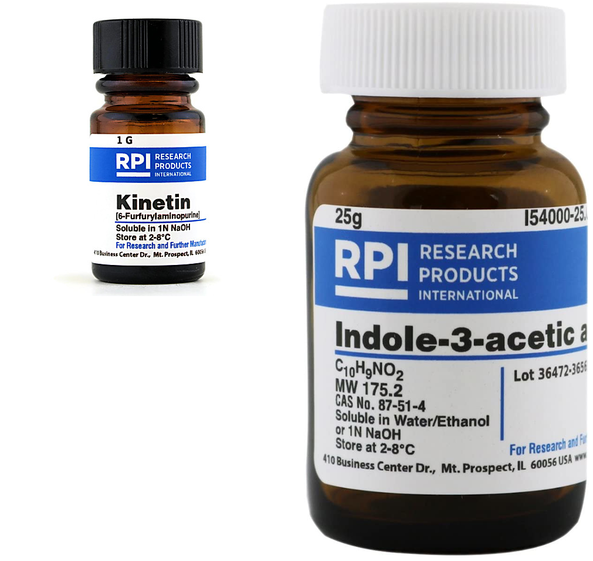

```{r setup, include=FALSE}
library(knitr)
require(tidyverse)
set.seed(453)
# invalidate cache when the package version changes
knitr::opts_chunk$set(tidy = FALSE, echo = FALSE, 
                  message = FALSE, warning = FALSE,
                  out.width = "45%")
options(knitr.table.format = "latex")
options(knitr.kable.NA = "", digits = 2)
options(kableExtra.latex.load_packages = FALSE)
```

# Overview

### Background

- In vitro = a-xenic = sterile culture
- Plant tissue culture is generally used for the aseptic culture of cells, tissues, organs, and their components under defined physical and chemical conditions in vitro.
- First approach made by Henri-Louis Duhumel du Monceau in 1756 (observed callus formation in plants)
- Development of cell theory by Schleiden and Schwann during 1830s
- Theoretical basis for plant tissue culture was proposed by Gottlieb Haberlandt in his address to the German Academy of Science in 1902 on his experiments on the culture of single cells.
- Definition: It is a technique of growing plant cells, tissues and organs in an artificial prepared medium under aseptic conditions.

### History

- The first true plant tissue cultures were obtained by Gautheret (1934, 1935) from cambial tissue of _Acer pseudoplatanus_.
- The first plant growth hormone indoleacetic acid (IAA) was discovered in the mid-1930s by F. Kogl and his coworkers. 
- In 1934 Professor Philip White successfully cultured tomato roots. 
- In 1939 Gautheret successfully cultured carrot tissue. 
- Later in 1955 Carlos Miller and Folke Skoog published their discovery of the hormone kinetin, a cytokinin. 
- In 1962, Toshio Murashige and Skoog published the composition a plant tissue culture medium known as MS (named for the first letters of their last names) medium. 
- Murashige was a doctoral student in Professor Skoog’s lab, and they developed the now-famous MS medium working with tobacco tissue cultures.

### Some terminologies

- Dedifferentiation: The phenomenon of mature cells reverting to a meristematic state and forming undifferentiated callus tissues.
- Redifferentiation: The ability of the component cells of the callus to differentiate into a whole plant or a plant organ is termed as redifferentiation.
- Cellular totipotency: These two phenomena of dedifferentiation and redifferentiation are inherent in the capacity of a plant cell, and thus giving rise to a whole plant in known as cellular totipotency.

### Basic steps

- Select the source of explant
- Trimming
- Several washes in running water
- Surface sterilization
- Basic sterilization
- Preparation of culture media 
- Culture in a good environmental condition
- Sub culture, if necessary
- Plant regeneration, hardening and transfer to soil

# Tissue culture laboratory setup

###

```{r tissue-culture-room, out.width="98%", fig.align='center'}

```

###

\begin{columns}[T,onlytextwidth]
  \column{0.5\textwidth}

```{r blueberry-propagation-media, fig.cap="Blueberry micropropagation container", out.width="70%"}

```

  \column{0.5\textwidth}

```{r invitro-gene-bank, out.width="80%"}

```

\end{columns}


### Media preparations/culture evaluation

\begin{columns}[T,onlytextwidth]
  \column{0.5\textwidth}
  \begin{itemize}

  \item Bench
  \item Gas outlet
  \item Hot plate and magnetic stirrer
  \item Analytical and top-loading balances
  \item pH meter
  \item Refrigerator, freezer
  \item Water purification and storage system
  \item Dish-washing area
  \end{itemize}

  \column{0.5\textwidth}

  \begin{itemize}

  \item Storage facilities-glassware, chemicals
  \item Autoclave (pressure-cooker will work for small media volume)
  \item Low bench with inverted light and dissecting microscopes (avoid locating next autoclaves or other high-humidity areas)
  \item Fume hood
  \item Desk and file cabinets
  \item Desktop centrifuge, spectrophotometer, microwave (transformation studies and protoplast isolation)

  \end{itemize}

\end{columns}

### Aseptic transfer area

1. Laminar air flow transfer hood and comfortable chair
2. Dissecting microscope
3. Gas outlet
4. Vacuum lines
5. Forceps, spatulas, scalpel, and disposable blades

### Laminar flow cabinet and units

\begin{columns}[T,onlytextwidth]
  \column{0.4\textwidth}

```{r aseptic-transfer, fig.cap="Working in the laminar flow hood", out.width="80%"}
# pdftools::pdf_convert("./../../literatures/biotechnology/Plant Biotechnology and Genetics, 2008, p.402.pdf", pages = 137, dpi = 250, format = "png", filenames = "../images/laminar_flow_hood.png")
knitr::include_graphics("../images/working_laminar_flow_hood.png")
```

  \begin{itemize}
  \scriptsize
  \item Air purification system
  \item HEPA (High efficiency particulate air) filter
  \item Stainless steel working board
  \item Air blower
  \item UV lamp
  \item Safety glasses
  \end{itemize}

  \column{0.6\textwidth}

```{r laminar-cabinet, out.width="80%"}
# pdftools::pdf_convert("./../../literatures/biotechnology/Plant Biotechnology and Genetics, 2008, p.402.pdf", pages = 137, dpi = 250, format = "png", filenames = "../images/laminar_flow_hood.png")

```
  
\end{columns}

### Environmentally Controlled Culture Area

1. Shelves with lighting on a timer and controlled temperature
2. Incubators—with controlled temperature and light
3. Orbital shakers

### Conditions

- High humidity in culture room should be avoided.
- Most cultures can be incubated at $25-27~^\circ C$ under a 16:8-h light:dark photoperiod controlled by clock timers.
- Light conditions can be manipulated by mounted fluorescent lamps with light readings (by quantum radiometer-photometer) of 40-200 foot candles (full sun is approximately 10000 foot candles).

# Basal media components and preparation

- No single medium will support the growth of all cells.
- Literature serves best to the purpose, else suitable medium is based on trial and error.
- Medium contains in general, inorganic salts, and organic compounds like plant growth regulators, vitaims, a carbohydrate, hexitols, and a gelling agent.
- Iron stably provided in chelated form with EDTA.
- Medium can also include amino acids, antibiotics, or natural complexes.
- Sometimes cultures are grown in the dark and do not photosynthesize at all.
- Most media are adjusted to a pH of 5.2-5.8.
- Solidification is done using agar derived from seaweed or agar substitutes such as $Gelrite^{TM}$ or $Phytagel^{TM}$.
- Woody Plant Medium (WPM) is suitable for culturing trees.

### Inorganic salts

- The Murashige and Skoog (MS) (1962) formulation is the most widely used formulation.
- The MS formulation was developed to insure that no increases in cell growth in vitro were due to the introduction of additional salts from plant tissue extracts which were being tested at that time.
- The MS formulation insured that the inorganic nutrients were not limiting to tobacco cell growth and organic supplements such as yeast extract, coconut milk, casein hydrolysate, and plant extracts were no longer essential sources of the inorganic salts.

###

- The distinguishing feature of the MS inorganic salts is their high content of nitrate, potassium, and ammonium in comparison to other salt formulations.
- These salt stocks are prepared at 100 times the final medium concentration, and each stock is added at the rate of 10 ml per 1000 ml of medium prepared. The NaFeEDTA stock should be protected from light by storing it in a bottle that is amber colored or wrapped in aluminum foil. Concentrated salt stocks enhance the accuracy and speed of media preparation.
- Salt stocks are best stored in refrigerator and are stable for several months.

###

```{r inorganic-salts, fig.cap="Composition of the five inorganic salt stocks of the Murashige and Skoog Inorganic formulation", out.width="38%"}
# pdftools::pdf_convert("./../../literatures/tissue_culture/Plant Tissue Culture_Techniques and Experiments.pdf", pages = 38, dpi = 250, format = "png", filenames = "../images/inorganic_salt_ms.png")
knitr::include_graphics("../images/inorganic_salt_ms.png")
```

###

```{r is-formulation, fig.cap="Inorganic Salt Formulation of Several Commonly Used Basal Salts for Plant Tissue Culture in Milligrams per Liter of Medium", out.width="35%"}
# pdftools::pdf_convert("./../../literatures/tissue_culture/Plant Tissue Culture_Techniques and Experiments.pdf", pages = 39, dpi = 250, format = "png", filenames = "../images/is_formulation_mediums.png")

```

### Growth regulators

\begin{columns}[T,onlytextwidth]
  \column{0.5\textwidth}

```{r pgr, fig.cap="Common plant growth regulators used in plant tissue culture", out.width="90%"}
# pdftools::pdf_convert("./../../literatures/tissue_culture/Plant Tissue Culture_Techniques and Experiments.pdf", pages = 40, dpi = 250, format = "png", filenames = "../images/pgr_tissue_culture.png")
knitr::include_graphics("../images/pgr_tissue_culture.png")
```

  \column{0.5\textwidth}

```{r auxin-cytokinin, fig.cap="Commercial formulations of PGRs (Auxin and Cytokinin) used in tissue culture", out.width="60%"}
# pdftools::pdf_convert("./../../literatures/tissue_culture/Plant Tissue Culture_Techniques and Experiments.pdf", pages = 40, dpi = 250, format = "png", filenames = "../images/pgr_tissue_culture.png")

```

\end{columns}

### PGRs

- Type and concentration will vary according to the cell culture purpose. List is provided in Figure \ref{fig:pgr}.
- Auxin (IAA, NAA, 2,4-D or IBA) is required by most plant cells for division and root initiation.
- 2,4-D is widely used for callus induction.
- IAA, IBA and NAA are used for root induction.
- Auxins can be dissolved either in alkali or in ethanol (latter is toxic to plants).
- IAA stocks have a working duration of 1 weeks when kept away from light, they are thermostable, however.

###

- Cytokinins (kinetin, BA, zeatin and 2iP) promote cell division, shoot proliferation, and shoot morphogenesis.
- Cytokinins are prepared in a fashion alike Auxins, except that 1 N HCL and a few drops of water are used to dissolve the crystals.
- They can be stored for longer terms in the refrigerator and are thermostable.
- Normally, gibberellin is infrequently used in plant cell culture due to callus growth and auxin induced adventitious root inhibition.

###

- Since stocks are highly susceptible to isomeric conversions, it should be made up fresh before addition to the medium by filter sterilization.
- Abscisic acid (ABA), a plant hormone involved in leaf and fruit abscission and dormancy, is useful in embryo culture. Its stock solutions can be prepared in water. It is heat stable but light sensitive (conversion of cis to trans form in presence of light results in lesser biological activity).
- Addition of ethylene biosynthetic inhibitors such as silver nitrate is beneficial.

###

```{r stages-of-tc, fig.cap="\\textit{Brassica juncea} plants produced from hypocotyl explants. Shoots are produced when a combination of auxin and cytokinin is used.\\newline (a) Callus from hypocotyl explants (note the green fluorescent protein fluorescent sectors on some of the calli); (b) shoots from callus; (c) shoots elongating; (d) whole plantlets transferred to soil.", out.width="45%"}
# pdftools::pdf_convert("./../../literatures/biotechnology/Plant Biotechnology and Genetics, 2008, p.402.pdf", pages = 136, dpi = 250, format = "png", filenames = "../images/stages_of_tc.png")

```

### Vitamins

- Catalytic functions in enzyme reactions.
- Thiamine (B1), Nicotinic acid (B3) and Pyridoxine (B6) are added to cell culture media.
- Stocks best stored in freezer.
- 10-ml aliquots used per liter of medium prepared.
- Vitamin stocks used in these exercises contain 5 mg of nicotinic acid and 5 mg pyridoxine-hydrochloride per 100 ml of water.
- The thiamine stock has 40 mg thiamine-hydrochloride in 1000 ml.

###

- **Common formulations**:

  - White (White 1963); in milligram-per-liter: 0.5 nicotinic acid, 0.1 pyridoxine-hydrochloride, and 0.1 thiamine-hydrochloride;
  - B5 Gamborg (Gamborg et al., 1976) with in milligram-per-liter medium: 100 inositol, 1.0 nicotinic acid, 1.0 pyridoxine-hydrochloride, and 10.0 thiamine-hydrochloride;
  - Murashige and Skoog (1962) with in milligram-per-liter medium: 100 inositol, 0.5 nicotinic acid, 0.5 pyridoxine-hydrochloride, and 0.1 thiamine-hydrochloride.

### Carbohydrates

- Green cells require carbohydrate source (as sucrose, glucose, fructose or even starch at 2-5% (w/v)) until they are photosynthetically active.
- Embryo and anther culture require higher levels of carbohydrates than that by protoplast culture.
- Sugars undergo caramelization if autoclaved too long.

### Gelling agent

- Provide stationary support
- Can include filter paper, cotton, cheesecloth, vermiculite, special membrane rafts with a liquid medium.
- Must include \alert{purified} agar.
- Gelrite is transparent in appearance and is a polysaccharide produced from fermentation from _Pseudomonas_ sps.
- Gelling should be done slowly in motion, while heating (in flask).
- Medium is then dispensed in measured amounts in the culture container.
- The agar can also be melted in the autoclave in a foil-capped Erlenmeyer flask for 15 min at $121^\circ C$, 15 psi.

### Amino acids

- Important in morphogenesis.
- L-forms are natural forms, which is also the only detectable form.
- L-tyrosine can contribute to shoot initiation, L-arginine can facilitate rooting, L-serine can be used in microspore cultures to obtain haploid embryos.
- Casein hydrolysate, an enzymatic digest of milk protein (caution: do not use the acid digest of milk proteins), was a common ingredient in many early media formulations as it provided a mixture of amino acids to enhance tissue response.

### Antibiotics

- Incorporation of bactericides and fungicides is to overcome contamination.
- Generally not desired because they can be toxic to explants.
- Transformaiton experiments using agrobacterium make it necessary to incorporate antibiotics (e.g. Timentin, carbenicillin (500 mg/liter), cefotaxime (300 $\mu$g/ml)).
- Should be added to medium after autoclaving.

### Natural complexes

- Antioxidants, absorbents (charcoal), coconut endosperm, yeast extract, malt extract, tomato juice, etc.
- Activated charcoal may be growth promoting (promotes morphogenesis and absorbs inhibitory compounds)

### Media pH

- Agar will not gel properly above 6.0 (too firm gel).
- pH naturally drops by 0.6-1.3 units after autoclaving and after cetain period of culturing.
- Medium pH is adjusted with 1.0 or 0.1 N HCL or NaOH by using a medicine dropper

# Explant preparation

### Explant age

- Younger tissue is more responsive _in vitro_.
- Older tissues might not form callus.

### Season

- Spring season is appropriate time for good response in culture.
- Tissues that have met dormancy requirements are useful.
- Artificial chilling might also help enable break dormancy.
- Contamination is associated with summer season.

### Explant size

- Smaller the explant, the harder it is to culture.
- Internal differences in hormone balance in the tissue can result in varying
in vitro responses.

### Plant Quality

- Healthy, unstressed, virus free.

### Goal

- If clonal propagation is the goal, then the explant will usually be a lateral or terminal bud or shoot.
- For callus induction, pieces of the cotyledon, hypocotyl, stem, leaf, or embryo are usually used.
- Excellent explants for callus induction are seedling tissues from aseptically germinated seeds or imma ture inflorescences.
- Leaf tissue from the aseptically germinated seed is a good source of tissue for protoplast isolation.
- To produce haploid plants or callus, the anther or pollen is cultured.

### Explant source

\begin{columns}[T,onlytextwidth]

\column{0.5\textwidth}

```{r explant-source, fig.cap="Schematic drawings (from top to bottom) of a plant, a flower, and monocotyledenous and dicotyldenous seeds indicate potential explant tissues.", out.width="45%"}
# pdftools::pdf_convert("./../../literatures/tissue_culture/Plant Tissue Culture_Techniques and Experiments.pdf", pages = 51, dpi = 250, format = "png", filenames = "../images/explant_sources.png")

```

\column{0.5\textwidth}

```{r explant-source-strawberry, fig.cap="Strawberry (\\textit{Fragaria} spp.) runner tip with 3 sites for obtaining meristematic tissue. When making each series of cuts, start at the bottom line and work up.", out.width="90%"}

```

\end{columns}

### Other factors

- Genotype: The ability to form regenerable callus in sorghum is heritable, and acted as a dominant trait (Ma et  al., 1987). Also, rice regeneration is under control of both nuclear and cytoplasmic genes.
- Aseptic technique
- Asceptic germination of seeds
- Contamination

# Processes and mechanism

### Growth progression

```{r growth-curves, fig.cap="The rate of growth of callus tissue usually has five stages: (1) a lag phase in which cells prepare to divide; (2) a period of exponential growth in which cell division is maximal; (3) a period of linear growth in which division slows down and cells enlarge; (4) a period of decelerating growth; and (5) a stationary or no-growth period in which the number of cells is constant.", out.width="40%"}
# pdftools::pdf_convert("./../../literatures/tissue_culture/Plant Tissue Culture_Techniques and Experiments.pdf", pages = 75, dpi = 250, format = "png", filenames = "../images/growth_curve.png")

```

### Callus induction

- Explants may be an aseptically germinated seedling or surface-sterilized roots, stems, leaves, or reproductive structures.
- _Callus_ is a wound tissue produced in response to injury. It is a proliferation of cells from the wounded or cut region of an explant. Callus is generally made up of friable, large, vacuolated cells that are highly differentiated, but are unorganized.
- Callus can be hard and compact, and can contain regions of small meristematic cell clusters, which are undifferentiated cells competent to regenerate via somatic embryogeny or organ initiation.
- Culture media (level of growth regulators) and conditions (temperature, light, solid vs. agar media) are important for callus formation and development.
- Culturing is maintained in dark condition at $25-28^\circ$ C.
- Medium generally has half-strength MS medium (for carrot) which is replaced by Gamborg's B5 medium after germination.

### Regeneration and morphogenesis

- Somatic embryogenesis (direct or indirect): plant or embryo is derived from a single somatic cell(not involved in embryo development)
- First documented by Steward et al. in 1958 with carrot cell suspension culture
- Dividing cells undergoing embryogenesis first form a globular stage, then a heart stage, and then a torpedo stage, from which plantlets develop.
- Shoot and roots are monopolar while somatic embryos are bipolar
- Regeneration via somatic embryogenesis occurs in five steps: 
  - initiation of embryogenic cultures,
  - proliferation of embryogenic cultures,
  - prematuration of somatic embryos,
  - maturation of somatic embryos and,
  - plant development on nonspecific media.

###

- Initiation and proliferation occur on a medium rich in auxin, which induces differentiation of localized meristematic cells.
- Once transferred to a medium with low or no auxin, these cells can then develop into mature embryos.
- Germination occurs when it is mature enough to have functional root and shoot apices
- Somatic embryogenesis follows organogenesis, during which organs and specialized tissues roots and shoots form.
- Cell suspension culture may undergo organogenesis (through formation of callus) without embryogenesis.

### Cell culture pathway

```{r cell-culture-pathway, fig.cap="A typical cell culture pathway.", out.width="28%"}
# pdftools::pdf_convert("/home/deependra/Downloads/Plants from Test Tubes_ An Introduction to Micropropagation-Timber Press (2013).pdf", pages = 161, filenames = "cell-culture-flowchart.png", format = "png", dpi = 280)


```

# Bibliography

## References