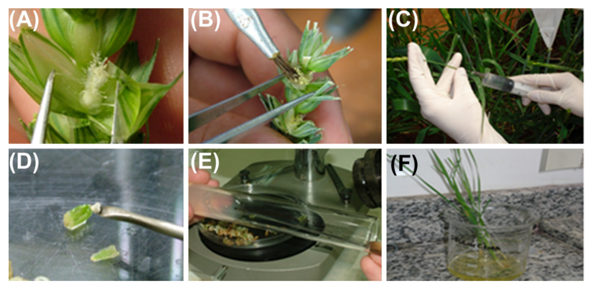
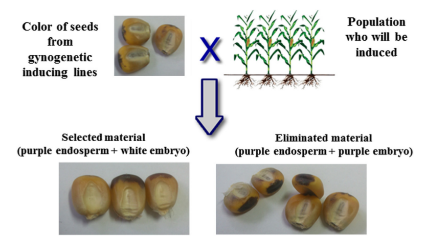
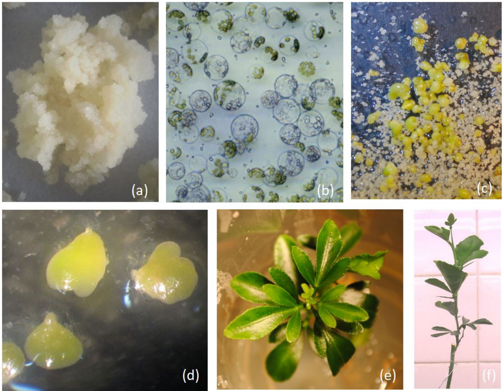
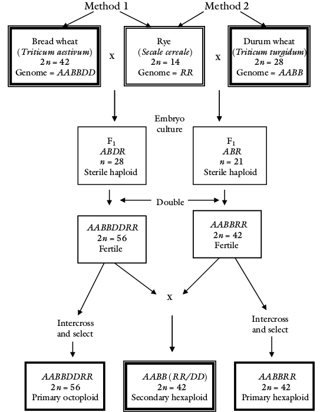
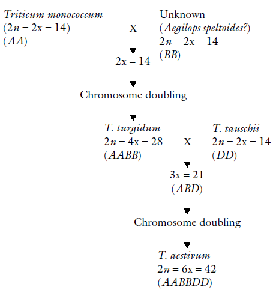

```{r setup, include=FALSE}
library(knitr)
require(tidyverse)
set.seed(453)
# invalidate cache when the package version changes
knitr::opts_chunk$set(tidy = FALSE, echo = FALSE, 
                  message = FALSE, warning = FALSE,
                  out.width = "45%")
options(knitr.table.format = "latex")
options(knitr.kable.NA = "", digits = 2)
options(kableExtra.latex.load_packages = FALSE)
```


# Organ culture

##

- Root: excised radical tip.
- Leaf: Immature young leaf of shoot apex.
- Shoot tip: 0.1-1.0 mm terminal portion of shoot.
- Meristem : < 0.1 mm.
- Flower: excised floral bud.
- Ovary : isolated ovary.
- Ovule culture
- Embryo culture

# Double haploids

##

- Haploids are individuals possessing a single set of chromosomes of the species (n; number of chromosomes in a gamete).
- DHs were first reported in 1920 in a dwarf cotton plant. Later in _Datura stramonium_ and _Nicotiana tabacum_.
- Haploid induction and double haploid generation can be achieved by:
  - Haploid inducing gene
  - Anther/microspore culture
  - Interspecific cross
- No direct benefits to cultivation -- less vigorous, susceptible to biotic and abiotic stresses.
- In plant breeding, they are prized because they are completely **homozygous** for all loci and this phenomena can be obtained in very short period of time. Self pollinating population require 5-8 generations of selfing in order to achieve desired level of homozygosity.

##

$$
\text{Homozygosity}_n = 1 - \left(\frac{1}{2}\right)^n
$$

```{r homozygosity-accumulation}
homozygosity_accumulation <- function(n){1 - (1/2)^n} # n = generations of crossing and selfing since parental after parental generation; n = 1 for F1 generation
homozygosity_accumulation(1:7) %>% 
  enframe(name = "Generations", "Homozygosity") %>% 
  mutate(Homozygosity = scales::percent(Homozygosity)) %>% 
  knitr::kable(booktabs = TRUE, caption = "Percentage of homozygosity and number of self pollinations needed to obtain inbred lines in a traditional breeding program of autogamous species.")
```

## Haploid production

1. Selection of parents
2. Crossing
3. F1 plants are advanced to F2 for segregation (not necessary if parents with haploid inducer genes are used in crossing or if F1 gametes are available for culture)
4. F1/F2 are used as source of variability for DH lines production^[Simulation studies have shown that haploids from F2 plants may be more efficient due to greater segregation and opportunity of linkage breakages with the $\bigotimes$].

- Of several methods available,
  - Anther culture is efficient in barley, wheat, and brassicas, but not as successful in soybean, common beans and oats
  - Haploid inducing lines are commonly used in maize
- DH plants of over 250 species have been successfully reproduced using anther culture.
  
## Haploid plants from anther culture

- Gametic cell may be diverted from its normal organogenic route to develop a somatic cell, via embryogenesis or organogenesis, is responsible for haploid production.
- Culture of anthers or isolated micropsores to produce haploid plants is known as anther culture or microspore culture.
- Embryos can be produced via a callus phase or be a direct recapitulation of the developmental stages characteristic of zygotic embryos.
- late uninucleate to early binucleate microspores are the best explants for embryogenesis.
- Somatic embryos develop into haploid plants.

##

- Chromosome doubling can be further used to produce doubled haploids (homozygous).
- In addition, haploid embryos are used in mutant isolation, gene transfer, studies of storage product biochemistry, and physiological aspects of embryo maturation.

Flowdiagram ?

<!-- (Draw a tikzpicture here from Biotechnology and Plant Breeding, Page 204.) -->

## Procedure for anther culture

- Take young flower buds with immature anthers. Wash the buds. Surface sterilise and rinse with sterile water.
- Transfer the flower buds into a beaker containing basal media (50 anthers of tobacco in 10 ml media).
- Take one anther and crush in acetocarmine to test the stage of pollen. If found good, separate each anther from filament.
- Discard immature, overmature and injured anthers.
- Squeeze out microspores in pressing them against the side of beaker with a glass rod.
- Remove anther tissue debris by filtering through nylon sieve (pore size $40\mu$ for tobacco and $100\mu$ for maize). Filter again to obtain larger and viable microspores.
- Centrifuse the pollen suspension at low speed for 5 minutes.

##

- Inoculate anthers horizontally on nutrient medium (liquid, solid) by pipetting. Medium density for tobaccoo is $10^3-10^4$ microspores/ml.
- In case of Brassica, microspore is used for dissecting out the anthers. In case of cereals, spikes are harvested at uninucleate stage of microspore and then surface sterilise.
- Place 10-20 anthers in a 6 cm petri dishes.
- Seal each petri dish containing anther/microspores and medium with parafilm to avoid dehydration.
- If anthers are cultured in liquid medium then 50 anthers can be cultured in 10 ml of liquid.
- Incubate and observe.
- Shoots/plantlets (3-5 cm) transfer to another medium.

## Embryo culture/rescue

- Some species produce sterile seeds that fail to germinate. This infertility can result from incomplete embryo development, mutations in structures covering the embryos resulting in their death, or a type of recalcitrant dormancy for which no method of breaking dormancy has been developed.
- Embryos are isolated from immature ovules or seeds and are cultured _in vitro_.
- Embryo **rescue** also finds use in the production of interspecific hybrids between inviable crosses, whose seeds are discarded because of their inability to germinate.
- Generally, embryo culture goes hand in hand with in vitro control of pollination and fertilization to ensure hybrid production.
- Immature embryos can be used to produce embryogenic callus and somatic embryos or direct somatic embryos.

## Embryo rescue: Application

\footnotesize

- Genes for tolerance/resistance to biotic or abiotic stresses have been lost because of the intense process of domestication.
- Most frequently breeders resort to wild species to isolate new tolerance and resistance genes.
- Although sexual crossing between different species is possible, in gamete fusion and embryo formation, **embryo abortion** (because of endosperm malformation) as a post-zygotic barrier is common.
- Embryo rescue in culture media (that provides all the nutritional requirements to replace the endosperm function of nourishing the embryo) promotes normal development, enabling the generation of interspecific hybrids and in some cases hybrids between different families.
- Depending on the developmental stage, the embryo should require only inorganic nutrients and a carbohydrate source in the culture medium, although supplementation with growth regulators, antioxidants, vitamins, and other substances is required for very young embryos.

##

\footnotesize

- Zygotic embryo culture method has been used successfully in palm trees, demonstrated by the increased germination rate, plant uniformity, and conversion of viable seedlings in species including _Cocos nucifera_ [@ake2007effect], and _Hyophorbe lagenicaulis_ [@sarasan2002vitro].
- An experiment evalutated effect of nutrition supplement on *in vitro* germination of macauba palm ( _Acrocomia aculeata_) seedlings, which take approximately 2 years to germinate in nature.
  - Embryos were excised and were inoculated into test tubes containing 15 mL of MS culture medium at 50 and 100% concentrations of mineral salts, supplemented with coconut water (0, 50, 100, and 150 $mL L^{-1}$). The cultures were maintained in a growth room at approximately $42 W m^{-2}$ irradiance, $25\pm 2^\circ C$, and a 16-hour photoperiod.
  - Higher percentage of embryo germination was observed at 60 days in the MS medium at the original concentration of salts (95.6%). The growth and conversion of viable or normal seedlings that were acclimatized required MS culture medium containing half the salt concentration supplemented with $50 mL L^{-1}$ coconut water.

## Interspecific hybridization for DH generation

- Successfully carried out in potato, alfalfa, brassica, wheat, oat, triticale and strawberry.
- In wheat, spikelets of greenhouse grown plants are emasculated.
- Three days later, artificial pollination (generally during morning) is done using maize pollen. Pollination may be repeated the later day to improve the success.
- Maize pollen type/source genotype determines frequency of embryo and caryopsis formation.
- $2,4-D$ and $Ag NO_3$ are applied 24 hours after second pollination.
- Immature embryos are rescued 16-18 days after pollination, and transferred to P2 medium for *in vitro* culture. Haploid plant can grow up to the period of chromosome duplication in this medium.
- The development of an individual from unfertilized ovules is called parthenogenesis. Frequently, parthenogenesis occurs *in vivo* and in this case is named polyembriony, as in citrus.

##

```{r wheat-embryo-rescue-wide-hybridization, fig.cap="\\textbf{Wide cross}. (A) Emasculation of wheat plants; (B) Pollination with maize pollen; (C) Application of 2,4-D and AgNO3 solution; (D) Embryo rescue; (E) Transfer to tissue culture; and (F) Double-haploid plant produced.", out.width="60%"}

```

## Genetics of haploidization

- Depending on the incompatibility of the parent genome, one of the genomes (usually male parent) is eliminated producing an haploid embryo parthenogenically.
  - Androgenetic haploid (generally induced by W23 -- efficiency ranges 0-2%)
  - Gynogenetic haploid (generally induced by Stock 6 -- efficiency ranges 1-2%)
- Androgenetic haploids are known to have gametofitic indeterminate (ig) mutation. 
- Haploid inducing lines are mostly adapted to temperate climates.
- Genome elimination usually follows several of the following incidents:
  - there is no perfect pairing (spatial separation) of chromosomes of the two species during division
  - faulty kinetochore/spindle fiber interaction
  - asynchronous cycles lead to production of micronuclei, which hold the chromosomes isolated that otherwise would have migrated to the poles
  - "actual nucleus" recognizes chromosomes as foreign DNA and cause their heterochromatinization and degradation.
  - over several cycles of mitosis, complete chromosome elimination is achieved

## Identification of haploids

```{r gynogenetic-haploid-identification, fig.cap="Morphological marker for seed color to identify haploids", out.width="70%"}

```

## Production of doubled-haploids

- Colchicine is a mitotic inhibitor commonly used in chromosome duplication and also as a pre treatment for microscope slide preparation.
  - Bounds to the tubulin and inhibits the formation of microtubules that are part of the fuse fibers, avoiding the migration of the chromosomes.
- Stongly carcinogenic! (Alternatives are: dinitroaniline group, such as trifluraline and pendimethalin)

##

- In haploid maize duplication:
  - seeds are germinated in a moistened germination paper
  - after radicle emergence small cut is made on seedling coleoptile for better colchicine inifiltration
  - Colchicine is used at 0.06% concentration along with 0.5 to 0.75% of DMSO (dimethyl sulfoxide), seedlings are left drenched in the solution for 12 to 17 hours.
  - After this treatment the roots are dried and transplanted to trays with a substrate
of 1:1 of soil and vermiculite.
  - plants are acclimated
  - about 30% of the haploid plants treated with colchicine may be self pollinated to set 100% homozygous seeds.

<!-- Applications of Embryo Cultures -->

<!-- Nonviable Hybrid Embryo Rescue -->

<!-- The hybridization process involves a sequence of events that includes pollen germination, pollen tube growth, fertilization, embryo and endosperm development, and seed maturation. There are a number of barriers to hybridization, which can be classified as pre fertilization (geographic isolation, apomixes,and pollen-pistil incompatibility) and post-fertilization (different ploidy levels, chromosome alterations, elimination of chromosomes, incompatible cytoplasms, seed dormancy, and embryo collapse) barriers. Interspecific and intergeneric crossings offer plant breeders a method to increase genetic variability and the transfer of desirable genes between species, mainly from wild to cultivated species. Barriers to pre- and post-fertilization can occur during the crossings, resulting in wilting seeds and abortive embryos. For example, pollen failure during penetration in an odd pistil or in two distantly related genomes may be incapable of producing a viable embryo when combined. However, the use of hybridization between closely related species is often limited by failures in post-fertilization endosperm development, that is, fertilization occurs and the embryos begin to develop but degenerate before reaching maturity given the inability of the endosperm to supply the embryos with nutrition. Therefore, hybrid embryos can be rescued if they are removed before the abortion occurs and are artificially cultivated on a nutrient medium. According to @alves2011vitro, the African oil palm tree (Elaeis guineensis) is the world's greatest source of vegetable oil. However, a fatal yellowing disease is decimating crops in the state of Par?, Brazil. Interspecific hybrids of Elaeis oleifera ? Elaeis guineensis are a viable alternative to overcome this problem. The study demonstrated that different varieties require different concentrations of 2,4-D for callus induction, and the appropriate concentrations of 2,4-D were 375 and 625 $\mu M$ for the SJ-167 and SJ-165 varieties, respectively. -->

# Meristem culture for virus free plants

- For the production of pathogen-free plants
- Apical meristem tips is used (hence, aka. meristem culture, meristem tip culture, or shoot tip culture)
- The apical meristem is usually a dome of tissue located at the extreme tip of a shoot and measures 0.1 mm in diameter and 0.25-0.3 mm in length. The apical meristem together with one or three young leaf primordial measuring 0.1-0.5 mm constitutes the shoot apex
- Meristem culture in combination with thermotherapy has resulted in successful production of virus-free plants.
- Culture involves the development of an already existing shoot apical meristem and the regeneration of adventitious roots.
- Usually, 5-10 mm shoot apices containing the shoot meristem along with several leaf primordia are used.

##

- Benefits of meristem culture:
  - Rate of cell division is high than virus multiplication.
  - High metabolic activity, No virus replication.
  - No vascular system, no movement of viruses.
  - Endogenous auxin level high, inhibit virus multiplication.

## Procedure for meristem culturing

\small

- Selection
  - Take apical meristematic dome or apical dome with leaf primordial by applying V-shaped cut with a sterised knife and cut is applied 0.3-0.5 mm below the tip of dome. (0.3 – 0.5 mm: virus free, less than 2 cm: contamination but survival/success rate is high)
- Culture establishment; According to Murashige, there are 3 stages of cultures to be needed
  - Stage I: culture establishment stage: supplemented with cytokinin, if large sized explant used, supply auxin (0.45-10 micro mole).
  - Stage II: axillary shoot proliferation is followed. Supply high level of cytokinin (4.5 – 25 micro mole)
  - Stage III: de novo regeneration of adventitious roots from the shoots obtained at stage II
  - In vitro produced shoots of sufficient length are cut and placed on another medium containing high level of auxins and low cytokinin  at stage III.

##

- Growing
  - Temperature should be $20-28^\circ C$ to $24-26^\circ C$.
  - Light duration: 16 day hour and 8 night hour.
  - Light intensity: 1-10 k lux.
  - Relative humidity
  - Oxygen

# Somatic hybridization/Protoplast fusion

##

- Cytoplasmic genomes are inherited maternally following sexual hybridization. Consequently, new nuclear-cytoplasmic combinations can be produced sexually only through backcrossing, which is a time-consuming and random.
- Somatic hybridization provides a means to overcome sexual barriers in plant breeding. 
  - provides a means to generate hybrids between sexually incompatible plants 
  - facilitates the genetic modification of sterile or subfertile plants of vegetatively propagated species and plants with long reproductive cycles.

- For a discourse on the title "Somatic Hybridization and Applications in Plant Breeding", refer to [@johnson2001somatic]

##

\footnotesize

- Because protoplasts lack a cell wall, the cell membrane is the only barrier between the extracellular and intracellular environments. Plant somatic hybridization involves four distinct stages:
  - protoplast isolation;
  - protoplast fusion;
  - regeneration of plants from selected tissues; and
  - analysis of regenerated plants.
- Following enzymatic digestion of cell wall (by pectinase, cellulase) and then of cell membrane.
- Isolated from cellular debris using filtering mesh and then floatation (in sucrose) technique.
- Cultured in high osmotic medium (solid or liquid); if solid also embedded in an alginate matrix.
- Fusion can be achieved either by **chemical** or **electrical** methods.
- Fusion is accomplished by use of PEG (polyethylene glycol), dextran, or polyvinyl alcohol (PVA) through induction of poration. PEG with a low carbonyl content, such as 30% PEG 1500 solution, must be used to obtain a high frequency of heterokaryon formation.

##

- Following steps steps follow protoplast electrofusion (less damaging than chemical method):
  - alternating current is used to transfer the protoplasts and to promote a close contact between the membranes, and
  - continuous short pulses are used to induce membrane disruption at the contact points.
- Protoplast fusion produces heterokaryons(fusion product of the intended genetic manipulation and can develop within hybrid cells (Figure \ref{fig:protoplast-fusion} C)) and homokaryons, and a number of the protoplasts remain unfused.

##

- The incompatibility between the two nuclear genomes or the nucleus-cytoplasmic combinations may lead to the elimination of chromosomes or, in extreme cases, failure of the heterokaryons to sustain growth and division.
- Certain treatments (irradiation of protoplasts), can increase the elimination of chromosomes, resulting in fusion products that retain the nuclear genome of one parent in a mixed cytoplasm (Cybrids).
- Intergeneric and interspecific transfer of extranuclear genetic elements, including mitochondria and chloroplasts, and the treatments facilitates the transfer of genes that control chlorophyll content, resistance to herbicides, and CMS.
  - plasma membranes are disrupted temporarily, resulting in the formation of pores and cytoplasmic connections between adjacent protoplasts.

##

<!-- @geerts2008protoplast performed a study using protoplast fusion technology by somatic hybridization in Phaseolus. The success of interspecific breeding between _Phaseolus vulgaris_ L. (PV) and the two donor species, _Phaseolus coccineus_ L. (PC) or _Phaseolus polyanthus_ Greenm. (PP), required the use of donor species as the female parents. Although the incompatibility barriers were postzygotic, the success of the phase-F1 cross was very limited given the hybrid embryo abortion. The study described the use of protoplast fusion methods within the genera Phaseolus as an alternative to conventional crosses between PV, PC, or PP. A large number of heterokaryons were generated through different genotypes using protoplast fusion procedures based on both electrical (750 or $1500 Vcm^{-1}$) and chemical fusion using polyethylene glycol (PEG 6000) as the fusing agent. -->

<!-- The development of biotechnological tools, including protoplast fusion, provides a means of circumventing the natural barriers of the reproductive biology of various species found in conventional breeding systems. @pereira2003somatic reported the production of four somatic interspecific hybrids, Cleopatra mandarin + Volkamer lemon, Ruby Blood orange + Volkamer lemon, Rohde Red Valencia orange + Volkamer lemon, and Rangpur lime + Sunki mandarin and an intergeneric somatic hybrid Valencia orange + Fortunella obovata (Tanaka), which have been included and evaluated in breeding program rootstocks. To generate the hybrids, protoplasts were isolated from embryogenic calli and leaves and were chemically fused using polyethylene glycol. The plants were regenerated via somatic embryogenesis, and somatic hybridization was confirmed through leaf morphology, cytology, and DNA (RAPD) analyses. -->

```{r protoplast-fusion, echo = FALSE, fig.cap = "Process of somatic hybridization and plant regeneration between Citrus and Poncitrus group of plants. (a) embryonic callus line of Shamouti sweet orange; (b) protoplast fused after three pulses (35 micro second) of 220 v (DC); (c) pro-embryo 1 month after fusion; (d) heart shaped embryo two month after fusion; (e) in vitro plantlet of Cleopatra + Winter haven tetraploid somatic hybrid; (f) grafted plant of Shamouti sweet orange + 4475 citrumelo-Chios cybrid tetraploid somatic hybrid. (For more details refer to \\url{https://doi.org/10.3390/agriculture12020134})", out.width="60%"}

# pdftools::pdf_convert("/home/deependra/Downloads/agriculture-12-00134-v2.pdf", format = "png", pages = 7, filenames = "protoplast_fusion_citrus_genera.png", dpi = 300)


```

# Genetic transformation

## Agrobacterium mediated transformation

# Wide hybridization

##

- Search for desired genes should start from among materials in the primary gene pool (related species), then proceed to the secondary gene pool and, if necessary, the tertiary gene pool.
- Crossing involving materials outside the cultivated species is collectively described as wide crosses.
  - cross involves another species -- interspecific cross (e.g., kale)
  - cross involves a plant from another genus -- intergeneric cross (e.g., wheat).
- Crosses between crops with their wild progenitor species should not be considered wide crosses, since, despite the sometimes used different scientific names (barley _Hordeum vulgare_ was derived from _H. spontaneum_; lettuce _Lactuca sativa_ was derived from _L. serriola_). Genetically such "species" are fully compatible and behave genetically as an intraspecific cross (i.e. cross within the same species).

##

```{r triticale-development, fig.cap="Generation of Triticale made possible by wide hybridization between individuals of different genera.", out.width="35%"}

```


## Objectives of wide crosses

- Economic crop improvement
- New character expression
- Creation of new allploids (refer to following pages)
- Scientific studies
- Curiosity and aesthetic value

##

```{r wheat-evolution, fig.cap="Genome evolution of modern \\textit{Triticum aestivum} wheat -- a natural allopolyploid derived from wide hybridization. It's lineage can be traced back to at least three distinct ancestor groups.", out.width="45%"}

```

# Somaclonal variaiton

##

- In vitro culture of plants is supposed to produce clones (genetically identical derivatives) from the parent material.
- Tissue culture environment has been known to cause heritable variation called somaclonal variation.
- Sometimes variation *in vitro* can be epigenetic (result of environmental factors), which cannot be transferred through seed progeny.
- Causes include karyotypic changes, cryptic chromosomal rearrangements, somatic crossing over and sister chromatid exchange, transposable elements, and gene amplification.
- Some of these variations have been stable and fertile enough to be included in breeding programs.
- Geenerally used for inducing genetic changes for cold/salt tolerance, insect resistance, and new plant forms.

##

- Growing points like the shoot tips or axillary buds have the least chance of mutation.
- Adventitious shoot formation (as opposed to axillary shoot formation), callus, and cell suspensions have the greatest chance for genetic mutations because they are not genetically stable.
- Long-term cultures and cultures that are forced to grow quickly have greater prossibilities of mutation.
- Media with high levels of cytokinins and auxins, especially 2,4-D face genetic instability.


##

- If cloning is the objective of micropropagation, this form of variation is undesirable.

# Bibliography
