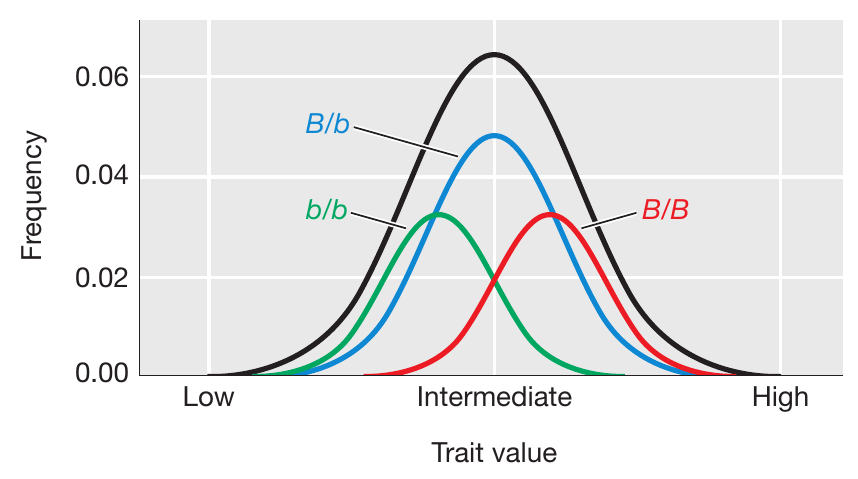
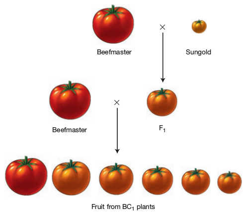
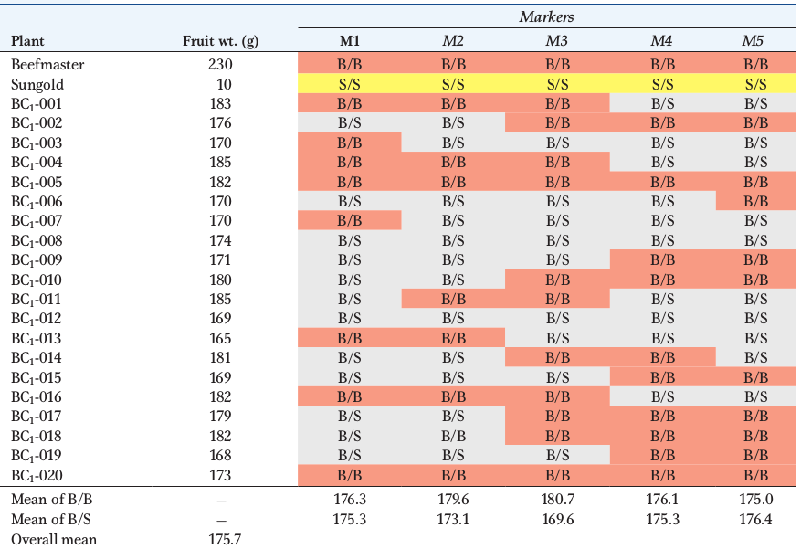
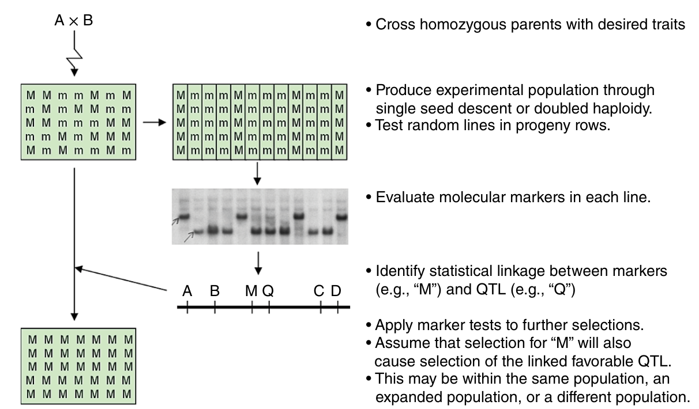

```{r setup, include=FALSE}
library(knitr)
require(tidyverse)
set.seed(453)
# invalidate cache when the package version changes
knitr::opts_chunk$set(tidy = FALSE, echo = FALSE, 
                  message = FALSE, warning = FALSE,
                  out.width = "50%")
options(knitr.table.format = "latex")
options(knitr.kable.NA = "", digits = 2)
options(kableExtra.latex.load_packages = FALSE)
```

# Molecular markers

### Definition and general features

```{r marker-trait-linkage, fig.cap="Marker-QTL linkage for arbitray loci $Q$ and $M$. On the right, linked loci show $cis$-conformation, while those on the right show $trans$-conformation.", out.width="90%", fig.align='center'}
knitr::include_graphics("../scripts/marker-qtl-association-diagram.pdf")
```

### Types

\footnotesize

- Genomic markers, have particular strengths and weakness, so, consideration and knowledge of the markers is necessary before use.
- For instance, a RAPD marker is dominant (identifying only one band of distinction) and it may be sensitive to reproducible results. This is typically due to the conditions in which it was produced. RAPD's are used also under the assumption that two samples share a same locus when a sample is produced.
- Commonly used molecular markers:
  - Restriction Fragment Length Polymorphism -- RFLP
  - Random Amplified Polymorphic DNA -- RAPD
  - Amplified Fragment Length Polymorphism -- AFLP
  - Variable Number Tandem Repeat -- VNTR
  - Oligonucleotide Polymorphism -- OP
  - Single Nucleotide Polymorphism -- SNP
  - Allele Specific Associated Primers -- ASAP
  - Inverse Sequence-tagged Repeats -- ISTR

### Applications

- Assessing variability of genetic differences and characteristics within a species.
- Identification and fingerprinting of genotypes.
- Estimating genetic distances between species and offspring.
- Identifying location of QTLs.
- Identification of DNA sequence from useful candidate genes.

# QTL mapping

### Overview

\begin{columns}[T,onlytextwidth]
  \column{0.6\textwidth}
  \footnotesize
  \begin{itemize}
  \item Genes that control variation in quantitative (or complex traits) are known as Quantitative Trait Loci (QTL) -- like genes!
  \item QTL have allelic variants that typically make relatively small, quantitative contributions to phenotype.
  \item Contribution of the alleles to a QTL to the trait value can be observed by looking at the frequency distributions associated with each genotype at a QTL as shown in Figure \ref{fig:allele-freq-distribution}.
  \end{itemize}
  \column{0.4\textwidth}
  
```{r allele-freq-distribution, fig.cap="Frequency distribution show the contributions of alleles at a QTL to a complex trait. Distributions for the different genotypic classes at QTL locus B relate to the overall distribution for the population (black lines)", out.width="90%"}

# pdftools::pdf_convert("/home/deependra/ddhakal/000readables/genetics_breeding/general_textbooks/2015_An Introduction to Genetic Analysis.pdf", pages = 769, filenames = "frequency_distribution_showing_contribution_qtl.png", format = "png", dpi = 250)

```

\end{columns}

### Method

\footnotesize

- QTL mapping is based on idea that location of QTL in the genome can be identified using marker loci linked to a QTL.
  - Suppose you make a cross between two inbred strains -- P1 (with high trait value) and P2 (with low trait value).
  - The F1 can be backcrossed to P1 to create a BC1 population in which the alleles at all the genes in the two parental genomes will segregate.
  - Marker loci such as SNP or microsatellites can be scored unambiguously as homozygous P1 or heterozygous for each BC1 individual.
  - If there is a QTL linked to the marker locus, then the mean trait value for individuals that are homozygous P1 at the marker locus will be different from the mean trait value for the heterozygous individual.

### Example

```{r tomato-beefmaster-sungold-cross, fig.cap="Breeding scheme for a BC population between Beefmaster and Sunglod tomatoes. In the BC1 generation, there is a continuous range of fruit sizes.", out.width="30%"}

```


###

\begin{columns}[T,onlytextwidth]
  \column{0.4\textwidth}
  \begin{itemize}
  \footnotesize
  \item Let us take two inbred lines of tomato that differ in fruit weight -- Beefmaster with fruits of 230 g and Sungold with fruits of 10 g weights.
  \item Cross the two lines to produce F1, then backcross the F1 to the beefmaster line to produce BC1 generation.
  \item Several hundered BC1 plants are grown and their fruit weights measured.
  \item Extract DNA from each of the BC1 plants. These DNA samples are used to determine the genotype of each plant at a set of marker loci (SSRs) (~100)  that are distributed across all of the chromosomes such that we have marker locus every 5 to 10 centimorgans.
  \end{itemize}
  \column{0.6\textwidth}

```{r tomato-fruit-weight-marker-data, fig.cap="Example data of fruit weight and marker-locus data for BC population between inbred lines.", out.width="95%"}

```

\end{columns}

###

- For each BC1 plant, we have the weight of its fruit and the genotypes at the marker loci. (Note: Trait values for the BC1 are intermediate between the two parents, but closer to the Beefmaster)
- Since this is BC population, the genotypes at each marker locus is either B/B or B/S.
- Crossover results in two markers appearing in recombinant/non-parental alignments (eg, BC1-001 has crossover between marker loci M3 and M4).
- The expectation is that there is no QTL affecting fruit weight near M1 -- For M1, the mean for genotypic classes B/B is 176.3 adn that for B/S is 175.3 (both lying close to overall mean 175.7). Now determine that for M3 ?
- For M3, it matches the expectation that there is a QTL affecting fruit weight near M3.

# Marker Assisted Selection

### Overview

- Individual genes contributing to complex plant traits can sometimes be discovered through their association with genetic markers -- \alert{QTL analysis}.
- Use of molecular markers in detecting regions of genome and discriminating between genotypes based on genomic features that enhance chances of inheriting favorable quantitative trait loci is called MAS.
- Rather than selecting traits, which are outcome of many genes, MAS is based on selecting specific alleles at marker loci that are known to be linked to the genes that cause the desired trait.

### Advantages

1. Avoids errors caused by environmental variance
2. Can be applied at a juvenile stage before a trait is expressed
3. Can be applied on a single plant
4. May be less expensive than phenotypic selection (it is debatable!)

```{r marker-assisted-selection, fig.cap="A simplified strategy for MAS. Here, a significant association between a QTL (Q) and a molecular marker allele (M) is identified in an experimental population. This information is applied in future populations in order to select Q indirectly through its linkage to M.", out.width="38%"}

# pdftools::pdf_convert("~/Desktop/readers_block/plb_gen_books/2016_Plant biotechnology and genetics _ principles, techniques, and applications.pdf", pages = 93, filename = "marker_assisted_selection.png", format = "png", dpi = 240)

```

### Requirements of QTL mapping

- Breeding facilities with environmental control, accurate phenotyping and trained manpower
- Incomplete linkage between a marker and the target QTL reduces the effectiveness of MAS
- Marker must be polymorphic on the parents
- MAS is effective only if the alleles being selected are important relative to other alleles in the population; For example a breeder might identify that allele A1 at locus A has a positive effect on yield. But this prediction would be made in a limited set of environments, and with a limited set of germplasm. A breeder who crossed a parent containing allele A1 with a new parent containing allele A4, and selected for A1 using a linked marker, might never discover that A4 is actually better than allele A1, or perhaps that allele A1 causes plants to be susceptible to a disease that was not present when A1 was first characterized. Hence, MAS should never to applied independently of phenotypic selection.


### Factors affecting QTL mapping using biparental populations

\footnotesize

1. Size of mapping population

- More the number of individuals in the population, more accurate the linkage map and accuracy in QTL results will be.
- Chances of detecting QTL with minor effects is high with larger population size
- Preferably > 200.
- Lesser population ~ overestimated QTL effects.

2. Nature of mapping populations

- Linkage maps could be drawn from the biparental populations in the following order of precision: F2 < BC < DH $\leq$ RILs
- Multiparental population such as Multi-parent Advanced Generation Intercross (MAGIC) populations, Nested Association Mapping (NAM) populations, Multiline Cross Inbred Line (MCILs), and Recombinant Inbred Advanced Intercross Lines (RIAILs) have to led to development of unique LD analysis methods and have variying accuracies.

###

3. Density and coverage of markers in the linkage map

- More the markers on the map, less the interval distance between two markers and more accuracy in the results.

4. Statistical methods used

- Single Marker Analysis (SMA) $<$ Simple Interval Mapping (SIM) $<$ Composite Interval Mapping (CIM) $<$ Inclusive Compositve Interval Mapping (ICIM) $\leq$ Bayesian Interval Mapping (BIM)

###

5. Heritability of the trait

- Greater the $h^2$, more the chance of QTL detection

6. Significance criteria used

- More false positives with arbitrary significance criteria; robustness and accuracy increases with permutation test and threshold values.

###

7. Effect of environment

- If the effect size of the QTL is small, it may not be detected in all the environments.

8. Experimental errors

- Greater the precision of phenotyping, chances increase for detection of small effect QTLs;
- Errors in scoring of genotypic data as well as missing marker data can affect the order of markers on the linkage map and can affect the estimated QTL location.

### Progress in MAS

- It is now possible to select across a genome rather than select for one or several markers for single QTLs. Genomic selection is an extension of MAS.
- In soybean, 50,000 single nucleotide polymorphic (SNP) markers are now available for use by breeders.

# Bibliography

### References
