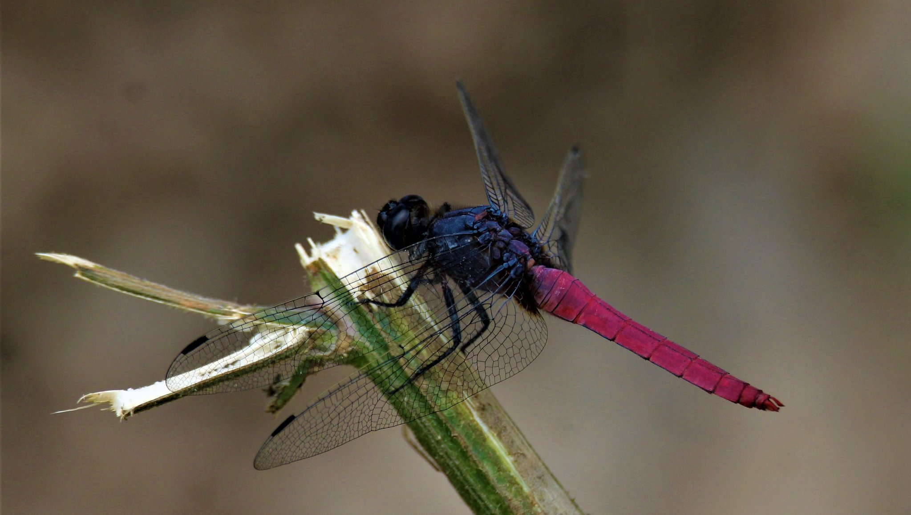
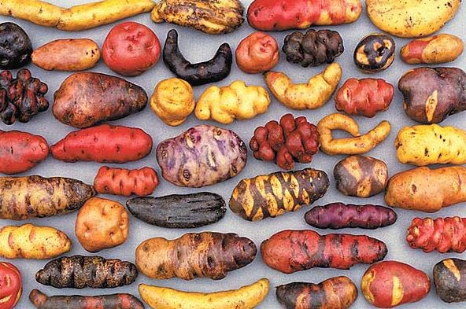

```{r setup, include=FALSE}
library(knitr)
require(tidyverse)
set.seed(453)
# invalidate cache when the package version changes
knitr::opts_chunk$set(tidy = FALSE, echo = FALSE, 
                  message = FALSE, warning = FALSE,
                  out.width = "45%")
options(knitr.table.format = "latex")
options(knitr.kable.NA = "", digits = 2)
options(kableExtra.latex.load_packages = FALSE)
```

# Concept

## Biodiversity

###

\begin{quote}
The extinction of species, each one a pilgrim of four billion years of evolution, is an irreversible loss. The ending of the lines of so many creatures with whom we have traveled this far is an occasion of profound sorrow and grief. Death can be accepted and to some degree transformed. But the loss of lineages and all their future young is not something to accept. It must be rigorously and intelligently resisted.
\end{quote}
\begin{flushright} --Gary Snyder (1990) \end{flushright}

### Meaning

- \alert{Diversity} refers to the range of variation or variety or differences among some set of attributes
- \alert{Biological diversity} Refers to all the living things on Earth and the ecological processes associated with them. 
- Mixture of \alert{Biology} and \alert{Diversity}
- Walter G. Rosen coined the term 'Biodiversity'.
- Described in hierarchical terms including ecosystem diversity, species diversity, and genetic diversity.

###

Biodiversity is an attribute of an area and specifically refers to the variety within and among living organisms, assemblages of living organisms, biotic communities, and biotic processes, whether naturally occurring or modified by humans. Biodiversity can be measured in terms of genetic diversity and the identity and number of different types of species, assemblages of species, biotic communities, and biotic processes, and the amount (e.g., abundance, biomass, cover, rate) and structure of each. It can be observed and measured at any spatial scale ranging from microsites and habitat patches to the entire biosphere.

###

- Biodiversity can be increased by natural evolutionary processes and genetic change or reduced by threats which lead to population decline and species extinction.
- Ecosystem diversity refers to the diversity of habitats, ecosystems, and the accompanying ecological processes that maintain them.
- The capacity of an ecosystem to respond to changes and threats determines the rate of biodiversity loss.
- Biodiversity tends to cluster in hotspots.
- Endemism is the state of a species or other taxon being restricted to a given area, such as a specific habitat, region, or continent.
- Current species inhabitation of earth is estimated at 10-14 million.
- Mass composition of biosphere is estimated at 4 Trillion mt of Carbon.
- The term 'biodiversity' emerged in the 1980s as a result of the changing understanding of the role of diversity in natural processes.

###

\begin{columns}[T,totalwidth=\textwidth]
  \column{0.5\textwidth}

```{r dragonfly, fig.cap="Arthropod diversity; Dragonfly", out.width="90%"}

```

  \column{0.5\textwidth}
{\footnotesize When a strongly channeled outflow cools down to $40^\circ$ or below, the diversity goes up rapidly. Metazoan animals can adapt to live directly in the warm water, and eukaryotic algae such as green algae and diatoms invade. Although cyanobacteria are still abundant, they are heavily grazed, and do not form a thick mat. In different expressions of this community are found crustacea, midges (Diptera), and water mites (Hydrachnellae), dominated by a top predator, the larva of the dragonfly, \textit{Erythemis collocatta}. The net effect on diversity is to increase the species numbers to 50 to 60, exclusive of the nonphotosynthetic microorganisms.}

\end{columns}

###

\begin{columns}[T,totalwidth=\textwidth]
  \column{0.45\textwidth}

```{r plantlice, fig.cap="Plants have lice too", out.width="70%"}
knitr::include_graphics("./../images/twttr/plant_lice_D4Ti2L6XsAI4xsQ.jpg")
```

  \column{0.55\textwidth}
  \begin{itemize}
  \footnotesize
  \item On land (forest), mites populate soil in 50,000-250,000 /$m^2$, down to 5cm depth
  \item In deserts, 500-1000 /$m^2$, they run deeper upto 10m where they follow plant roots
  \item Eat decaying organic matter (and the microorganisms contained), consume fungi, algae, nematodes, bacteria, etc.
  \item Oribatid mites in soil facilitate plant growth by dispersing the spores of mycorrhizal fungi, which form mutualistic associations with former.
  \item Many plants produce domatia -- hollow, mite sized cavities or pockets in the leaf. Experiments have shown that removal of domatia from some plants that normally have them reduces the density of beneficial predatory mites and increases the density of herbivorous mites.
  \end{itemize}

\end{columns}

### Definition

\begin{block}{Diversity}
\footnotesize
The existence of a wide variety of species (species diversity), other taxa of plants or other organisms in a natural environment or habitat, or communities within a particular environment (ecological diversity), or of genetic variation within a species (genetic diversity).
\end{block}

\begin{block}{Biodiversity defined under CBD Article 2(1)}
\footnotesize
the variability among living organisms from all sources including, inter alia, terrestrial, marine and other aquatic ecosystems and the ecological complexes of which they are part; this includes diversity within species, between species and of ecosystems
\end{block}

\begin{block}{Agrobiodiversity}
\footnotesize
The variety and variability of animals, plants, and microorganisms used directly or indirectly for food and agriculture (crops, livestock, forestry, and fisheries). it comprises the diversity of genetic resources (varieties, breeds, etc.) and species used for food, fuel, fodder, fiber, and pharmaceuticals.
\end{block}

###

```{r chromosome-distribution-oryza, fig.cap="Chromosome number, genome and distribution of species in Oryza", out.width="50%"}
# pdftools::pdf_convert("./../../literatures/ecological_genetics/Agrobiodiversity-conservation-securing-the-diversity-of-crop-wild-relatives-and-landraces.pdf", pages = 235, dpi = 250, format = "png", filenames = "./../images/oryza_distribution_chromosome.png")

knitr::include_graphics("./../images/oryza_distribution_chromosome.png")
```

### Distribution

- Generally, diversity is more in warmer and wetter climates than in cooler and drier ones (McNeely et al., 1990). Seventy per cent of the world’s biodiversity is found in only 12 "mega-diverse" countries -- Colombia, Ecuador, Peru, Brazil, Zaire, Madagascar, China, India, Malaysia, Indonesia, Australia and Mexico – which, with the exception of Australia, are all developing, non-Western nations.

- South africa contains the most biological diversity in plant species. [Wilson, 1992, p. 260]

- Mainly conditioned by
  - temperature,
  - precipitation,
  - altitude,
  - soils,
  - geography and
  - presence of other species

## Importance

### General values

- Species have utilitarian (subsistence and commercial) value to human,
- Biodiversity represents the natural balance within an ecosystem that provides a number of ecological services, including nutrient cycling and pollination of plants, and
- Species have intrinsic value; value of life
- Linked to daily livelihood and economic wellbeing of Nepalese
- Specifically,
  - Genetic diversity provides resources for genetic resistance to pests and diseases;
  - In agriculture, biodiversity is a production system characterized by the presence of multiple plant and/or animal species

###

```{r potato-diversity, fig.cap="Potato diversity", out.width="70%"}

```


### Ecosystem services: beneficial consequences of biodiversity

- Provisioning services which involve the production of renewable resources (e.g.: food, wood, fresh water). Greater species diversity
  - increases fodder yield
  - increases overall crop yield
  - increases overall wood production, in trees
- Regulating services which are those that lessen environmental change (e.g.: climate regulation, pest/disease control). Greater species diversity
  - of fish increases the stability of fisheries yield
  - of natural pest enemies decreases herbivorous pest populations
  - of plants decreases disease prevalence on plants
  - of plants increases resistance to plant invasion
  - of plants increases carbon sequestration, but note that this finding only relates to actual uptake of carbon dioxide and not long term storage
  - plants increases soil nutrient remineralization

### Nonmaterial services

\footnotesize

- Cultural services represent human value and enjoyment (e.g.: landscape aesthetics, cultural heritage, outdoor recreation and spiritual significance
- Betterment of knowledge systems
- Educational value

\begin{columns}[T,totalwidth=\textwidth]

\column{0.4\textwidth}

```{r pollinator-bees, fig.cap="Bees are excellent ecosystem service providers as pollinators", out.width="90%"}
knitr::include_graphics("./../images/twttr/bee_D8bkT-lUEAMzS8c.jpg")
```

\column{0.6\textwidth}

```{r landscape-diversity, fig.cap="Wildflowers in cliffs. Ecosystems also provide 'nature,' a landscape attribute that enhances outdoor recreation, esthetic experiences, and, for many people, provides a larger meaning and purpose to life. Esthetic benefits such as the enjoyment of scenic coastal views, mountain peaks, as well as the educational value of functioning natural systems, are included in the cultural ecosystem services.", out.width="60%"}
knitr::include_graphics("./../images/twttr/wildflower_cliff_D_OOw-NXoAEuyIO.jpg")
```

\end{columns}

### Ecosystem services: mixed and negative consequences of biodiversity

```{r biodiversity-thorns, fig.cap="Thorns of biodiversity", out.width="70%"}


```

## Status

### National

- Geographic diversity that ranges from alluvial plains in the tropical lowlands to very rugged and permanently snow and ice covered Himalayan Mountains.
- Five major **physiographic** landscapes extending from east to west, namely
  - High Himal,
  - High Mountains,
  - Middle Mountains,
  - Siwaliks and
  - Tarai
- The **climate** varies from alpine cold semi-desert type in the trans-Himalayan zone to tropical humid type in the Tarai lowlands.
- Forests (with shrubland): 39.6%
- Grasslands and pastures: 12%

###

- A total of 118 ecosystems
- Forest ecosystems can be categorized into ten major groups, namely
  - tropical,
  - subtropical broadleaved,
  - subtropical conifer,
  - lower temperate broadleaved,
  - lower temperate mixed broadleaved,
  - upper temperate broadleaved,
  - upper temperate mixed broadleaved,
  - temperate coniferous,
  - subalpine, and
  - alpine scrub.

###

- Wetlands characterized by high diversity. Nine of the country’s wetlands have been listed as Ramsar sites.
- 12 of the 867 global terrestrial ecoregions.
- Occupies about 0.1% of the global area, but harbors 3.2% and 1.1% of the world’s known flora and fauna, respectively.
- This includes 5.2% of the world's known mammals, 9.5% birds, 5.1% gymnosperms, and 8.2% bryophytes.
- The country is also rich in diversity of agricultural crops, their wild relatives, and domestic animal species and varieties.

###

- Over 550 crop species identified as having food value, and around half of those species are believed to be currently under cultivation.
- Horticultural diversity includes:
  - ~ 400 species and subspecies of crops
  - 45 species of seasonal fruits, 200 species of vegetables, including 11 local varieties of potatoes
- Diversity of domestic animals.
- Endemic organisms:
  - 284 flowering plants,
  - 160 species of animals (including one species of mammal),
  - 1 species of bird,
  - 14 species of herpeto-fauna
- The high altitude rangelands are especially important from the perspective of endemism.

## Types

### On the basis of organisation

- Within species diversity (Genetic diversity)
- Between species diversity ($\alpha$ diversity)
- Habitat diversity ($\beta$ diversity)
- Landscape diversity ($\gamma$ diversity)
- Temporal diversity
- Latter three are also recognized as ecological diversity.

### On the basis of ecological function

- Aquatic
- Terrestrial
- Boreal (subarctic climate located in the Northern Hemisphere, approximately between $50^\circ$ and $70^\circ$)
- Freshwater
- Groundwater-dependent
- Lake
- Marine
- River
- Mountain/montane
- Urban

### Genetic diversity

### $\alpha$, $\beta$ and $\gamma$ diversities

\footnotesize

- Concepts introduced by R. H. Whittaker
- Alpha diversity ($\alpha$-diversity) is the mean species diversity in a site at a local scale.
- To quantify the diversity components, species proportional abundances need to be taken into account. The proportional abundance of species $i$ that is conditional on the limits of subunit $j$ is $p_{i|j} = \frac{m_{ij}}{m_j}$, where $m_{ij}$ is the number of individuals belonging to species $i$ in subunit $j$ and $m_j$ is the total number of individuals in subunit $j$. The weighted generalized mean of all these within-subunit proportional abundance is

$$
{}^q\overline{P}_{i|j} = \sqrt[q-1]{\sum^N_{j=1} \sum^R_{i=1} p_{ij} p^{q-1}_{i|j}}
$$

Here N is the number of subunits. The proportion of data that individuals of species $i$ in subunit $j$ contribute to the entire dataset is $p_{ij}$ and this is used as the nominal weight when calculating mean within-subunit proportional abundance.

###

\footnotesize

The same mean $p_{i|j}$ can also be expressed as:

$$
{}^q \overline{P}_{i|j} = \sqrt[q-1]{\sum^N_{j=1}w_j \sum^R_{i=1} p_{i|j} p^{q-1}_{i|j}}
$$

Here the subunit weight $w_j = \frac{m_j}{m}$ equals the proportion of the individuals in the entire dataset contributed by subunit $j$. Alpha diversity is obtained as an inverse of this mean:

$$
{}^q D_{\alpha} = \frac{1}{{}^q\overline{P}_{i|j}}
$$

This can also be expressed as:

$$
^q {D}_{\alpha} = \sqrt[q-1]{\sum^N_{j=1}w_j (^q {D}_{\alpha j})^{1-q}}
$$

This formula expresses the weighted generalized mean with exponent $1 - q$ of the mean effective species densities $^q {D}_{\alpha j}$ in all subunits $j$.

- Alpha diversity can be calculated in both extinct and extant landscapes.

###

```{r relation-alpha-beta-gamma, fig.cap="The calculation of species richness and species diversity in a small dataset consisting of a single tree plot. Species richness is the number of boxes (the set at left) neeeded to place all individuals into a box with an appropriate species name. Species diversity is the number of new boxes needed (the sets at right) to place all individuals into a box such that each box receives as many individuals (or as large a proportion of all individuals as the named species have, on average (only a part of the last new box may be needed). The measure of 'average' here is the weighted generalized mean with exponent $q-1$. This can be calculated by first taking the weighted mean of the absolute species abundances(6, 7.7 and 9.1 individuals for q=0,1, and 2, respectively) and then dividing this by total abundance (18 individuals). Equally well, one can calculate the weighted mean of the proportional abundances, directly (as shown in the equation of the generlized mean; R is the number of actual named species and $p_i$ is the proportional abundance of the $i$th species). Species diversity ${}^q D$ equals the inverse of mean $p_i$, and it is the effective number of species (the number of equally abundant species that would give the observed mean species abundance). The measurement unit is hence actual species (sp) in the case of richness and effective species ($sp_E$) in the case of diversity. Reproduced from [@tuomisto2011commentary].", out.width="32%"}
# pdftools::pdf_convert("/home/deependra/ddhakal/000readables/ecology/2010_Encyclopedia of Biodiversity.pdf", pages = 1260, format = "png", filenames = "partitioning_of_species_diversity.png", dpi = 280)

```


### $\beta$ diversity

- Beta($\beta$) diversity is the ratio between regional and local species diversity. The idea was that the total species diversity in a landscape ($\gamma$) is determined by two different things, the mean species diversity at the local level ($\alpha$) and the differentiation among local sites ($\beta$). Other formulations for beta diversity include "absolute species turnover", "Whittaker's species turnover" and "proportional species turnover".

### Whittaker $\beta$ diversity

\footnotesize

$\gamma$ diversity and $\alpha$ diversity can be calculated directly from species inventory data. The simplest of Whittaker's original definitions of beta diversity is:

$$
\beta = \frac{\gamma}{\alpha}
$$

Here $\gamma$ diversity is the total species diversity of a landscape and $\alpha$ diversity is the mean species diversity per site. Because the limits among local sites and landscapes are diffuse and to some degree subjective, it has been proposed that $\gamma$ diversity can be quantified for any inventory dataset and that $\alpha$ and $\beta$ diversity can be quantified whenever the dataset is divided into subunits. $\beta$ diversity quantifies how many subunits there would be if the total species diversity of the dataset and the mean species diversity per subunit remained the same, but the subunits shared no species.

### $\gamma$ diversity

\footnotesize

$\gamma$ diversity is the total species diversity in a landscape. According to Whittaker, $\alpha$ diversity and $\beta$ diversity constitute independent components of gamma diversity:

$$
\gamma = \alpha + \beta
$$
Suppose species diversity is equated with the effective number of species in a dataset. Then gamma diversity can be calculated by first taking the weighted mean of species proportional abundances in the dataset, and then taking the inverse of this mean. The equation is:

$$
{}^{q}\!D_{\gamma }={1 \over {\sqrt[{q-1}]{\sum _{i=1}^{S}p_{i}p_{i}^{q-1}}}}
$$
The denominator equals mean proportional species abundance in the dataset as calculated with the weighted generalized mean with exponent $q - 1$. In the equation, S is the total number of species (species richness) in the dataset, and the proportional abundance of the $i$th species is $p_{i}$.

Large values of $q$ lead to smaller gamma diversity than small values of $q$, because increasing $q$ increases the weight given to those species with the highest proportional abundance, and fewer equally abundant species are hence needed to obtain this proportional abundance.

### Guild^[https://en.wikipedia.org/wiki/Guild_(ecology)]

- A guild (or ecological guild) is any group of species that exploit the same resources, or that exploit different resources in related ways.
- Species within a guild occupy the same/similar or different ecological niches.
- Guilds are defined according to the locations, attributes, or activities of their component species. For example, the mode of acquiring nutrients, the mobility, and the habitat zones that the species occupy or exploit can be used to define a guild.
- Members of a guild within a given ecosystem could be competing for resources, such as space or light, while cooperating in resisting wind stresses, attracting pollinators, or detecting predators, such as happens among savannah-dwelling antelope and zebra.

## Agrobiodiversity

### Classification: feature of life form

- Interspecific diversity
- Intraspecific diversity

### Classification: functional

- Planned
- Associated

::: incremental
- \alert{To what extent should we control associated diversity?}
:::

```{r tomato-diversity, fig.cap="Diversity of cocona (Solanum sessiliflorum) fruit size and shape has been created by selection for novel fruit types by Yanesha and other indigenous peoples of the upper Amazon; An example of Genetic diversity", out.width="48%"}
knitr::include_graphics("./../images/tomato_wild_domestic.png")
```

###

```{r habitat-landscape, fig.cap="Yanesha agricultural diversity over time: habitat (left) and landscape (right) diversities. Three lowland agricultural fields (left) are at three different agricultural successional stages (center): (1) corn, beans, and minor crops, (2) cassava and minor crops, and (3) bananas, plantains, and minor crops. Different habitats (beaches, lowlands, and uplands) each have different agricultural successional stages (center), resulting in a very diverse, patchy landscape (right), constantly changing over time.", out.width="70%"}
# pdftools::pdf_convert("./../../literatures/ecological_genetics/Biodiversity in Agriculture_ Domestication, Evolution, and Sustainability.pdf", pages = 470, dpi = 250, format = "png", filenames = "./../images/yanesha_habitat_landscape_diversity.png")

knitr::include_graphics("./../images/yanesha_habitat_landscape_diversity.png")
```

### Forms

\begin{columns}[T,onlytextwidth]

  \column{0.5\textwidth}
  \alert{Phenotypic variation in natural populations}
  \begin{itemize}
  \item Color pattern
  \item Morphology
  \item Behavior
  \item Phenology
  \item Differences among populations
  \item Nongenetic inheritance
  \end{itemize}

  \column{0.5\textwidth}
  \alert{Genetic variation}
  \begin{itemize}
  \item DNA
  \item Protein
  \item Chromosomes
  \item Genetic variation within natural populations
  \item Genetic divergence among populations
  \end{itemize}

\end{columns}

### Mechanisms

- Mutation
- Selection
- Genetic drift
- Migration
- Inbreeding

# Aim

### Identification and characterization

### Conservation biology

- Conservation biology is concerned with phenomena that affect the maintenance, loss, and restoration of biodiversity and the science of sustaining evolutionary processes that engender genetic, population, species, and ecosystem diversity.
- Protecting species, their habitats, and ecosystems from excessive rates of extinction and the erosion of biotic interactions
- The term and the field originated with the convening of "The First International Conference on Research in Conservation Biology" held at UCSD.
  - concern over tropical deforestation, disappearing species, eroding genetic diversity within species
- Closely related to ecology in researching the population ecology (dispersal, migration, demographics, effective population size, inbreeding depression, and minimum population viability) of rare or endangered species.

###

::: incremental

5. \alert{How can biodiversity be maintained or enhanced in agroecosystems?}
- Biodiversity is sum total of biological diversity at various levels of organization -- infraspecific, species, habitats, landscape.
- Replacing native biomes by agricultural vegetation is one of the major factors in the loss of overall biodiversity.
- Amidst increased demand for agricultural products (food, feed, fiber, or fuel), some of the responses that are suggested to maintain agrobiodiversity include:
  - creation of biosphere reserves,
  - converting agricultural production systems to more benign (shade-grown coffee, hedgerows),
  - productivity increases to allow set-aside programs of marginal lands
:::

### Sustainable resource allocation

- The concern stems from estimates suggesting that up to 50% of all species on the planet will disappear within the next 50 years -- the ecological footprint of society has exceeded the bio-regenerative capacity limits of the planet's ecosystems by about 30 percent!
- This method of measuring the global economic benefit of nature has been endorsed by the G8+5 leaders and the European Commission.
  - Many of the Earth's ecosystem services are public goods without a market and therefore no price or value.
  - There is no natural stock market with investment portfolios (we need it!) into sea horses, amphibians, insects, and other creatures that provide a sustainable supply of ecosystem services that are valuable to society.

### Awareness and appreciation

\footnotesize

1. Keystone species

\begin{columns}[T,onlytextwidth]

  \column{0.5\textwidth}
  \begin{itemize}
  \item Keystone species form a central supporting hub unique to their ecosystem. The loss of such a species results in a collapse in ecosystem function, as well as the loss of coexisting species.
  \item Are usually predators due to their ability to control the population of prey in their ecosystem.
  \item The wasp species Agelaia vicina has been labeled a keystone species for its unparalleled nest size, colony size, and high rate of brood production.
  \end{itemize}
  \column{0.5\textwidth}

```{r keystone-species-beetle-prey, out.width="50%"}
knitr::include_graphics("../images/myriophyllum-spicatum.png")
```

```{r keystone-species-beetle-predator, fig.cap="The herbivorous weevil \\textit{Euhrychiopsis lecontei} is thought to have keystone effects on aquatic plant diversity by foraging on nuisance Eurasian watermilfoil in North American waters.", out.width="50%"}

```

\end{columns}

###

2. Indicator species
  - Amphibians
3. Umbrella species
  - Monarch butterfly, because of its lengthy migrations and aesthetic value
  - An umbrella species is often used as flagship species, which are species, such as the giant panda, the blue whale, the tiger, the mountain gorilla and the monarch butterfly, that capture the public's attention and attract support for conservation measures.

# Scope

### Opportunity

- To enhance food and nutrition security
- To mitigate anthropogenic climate change
- To understand fundamental ecological processes
- To gain technological efficiency
- Enhance food systems production and productivity
- Enable lesser use of non-renewable sources of energy
- Generation of robust and reusable technologies
- To discover new ecological functions and ecosystems in its entirety

### Uses

- Economic welfare and policy formulation
- Human health and medicine
- Lifestyle/livelihood betterment
- Dealing with natural calamities and epidemics
- Meeting the needs of growing population: Fresh water, healthy and nutritious food, reliable shelter and accessories of daily life.
- Fostering social harmony
- Providing for extant ecosystem
- Remedying environmental troubles
- Commerce and industry sustenance
- Leisure, cultural and aesthetic value

# Bibliography

## References
