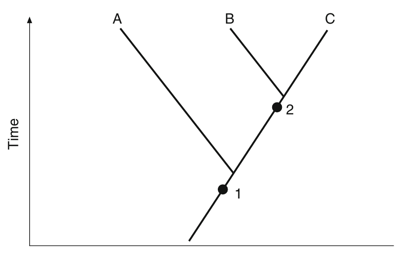
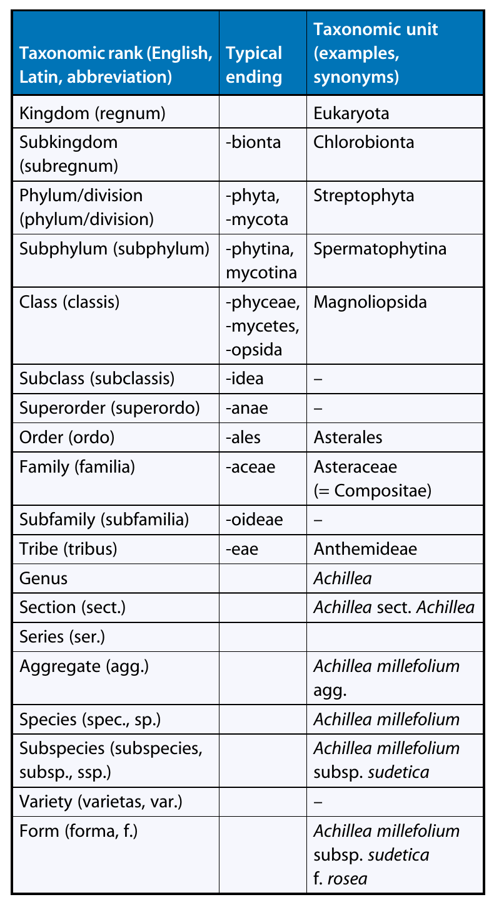

```{r setup, include=FALSE}
library(knitr)
require(tidyverse)
set.seed(453)
# invalidate cache when the package version changes
knitr::opts_chunk$set(tidy = FALSE, echo = FALSE, 
                  message = FALSE, warning = FALSE,
                  out.width = "45%")
options(knitr.table.format = "latex")
options(knitr.kable.NA = "", digits = 2)
options(kableExtra.latex.load_packages = FALSE)
```

# Background

### Level of organisation

- Biosphere
- Ecosystems
- Communities
- Populations
- Organisms
- Organs and organ systems
- Tissues
- Cells
- Organelles
- Molecules

### Systematics

- \textbf{Systematics} is a field of research which aims to organize the huge diversity of organisms.
- Objective is to use phylogenies that reflect natural relationships between organisms.
- Based on "relatedness"
- Who tests and verifies: Cytologists, geneticists, morphologist and evolutionary biologist.
- Traditionally morpho-anataomy was used to distinguish between organisms.
- In many cases, DNA sequences -- so-called DNA barcodes can be used to identify species (see http://barcoding.si.edu).
- **Monographs** are works concerning whole groups of related species (e.g., monograph of the genus Primula), and **floras** are systematic works concerning the plant inventory of a geographical area (e.g., flora of Germany).
- Monographs and floras contain descriptions of the species involved and also, by means of a key, the tools for identifying a plant.

### Relationships

```{r taxon-relationships, fig.cap="Relationships. The degree of relationship is defined by the relative age of the last common ancestor. Taxon B is more closely related to taxon C than to taxon A.", out.width="50%"}
# pdftools::pdf_convert("./../../literatures/Plant Science Straussberger.pdf", pages = 676, dpi = 250, format = "png", filenames = "./../images/relationship_common_ancestor.png")


```

### Characters

- Microscopic and macroscopic
- Morphology describes the external structure of plants and is very important in systematics.
- Anatomy is the study of internal plant structure. Includes: Histology, Cytology, Karyology, Palynology, Embryology
- The structure of plant compounds is dealt with in phytochemistry. 
- A systematist can also draw on characters from physiology, ecology, chorology (the geographical distribution of taxa), and phytopathology and can also consider information on fossil forms taken from paleobotany.
- Experimental systematics, using breeding experiments and crossing success as a criterion for relationships, is not applied now. Instead, the analysis of proteins and nucleic acids has taken on special significance in phylogenetic research.

### Taxonomic ranks

```{r taxonomic-ranks, fig.cap="Overview of the more important taxonomic ranks, their standardized ending, and the taxonomic units using yarrow (Achillea millefolium L.) as an example", out.width="25%"}
# pdftools::pdf_convert("./../../literatures/Plant Science Straussberger.pdf", pages = 683, dpi = 250, format = "png", filenames = "./../images/taxonomic_rank_yarrow.png")


```

